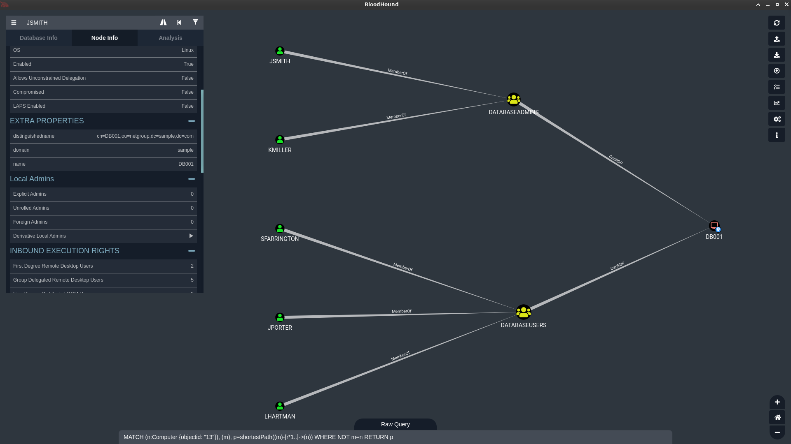
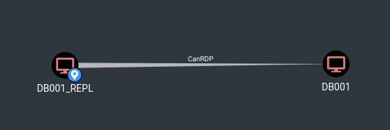

{:no_toc}

Bloodhound
==========

[Bloodhound](https://github.com/BloodHoundAD/BloodHound) is probably *the* most effective tool for auditing Windows environments, used by both red and blue teams alike.

But have you heard of [Bloodhound for Linux](https://github.com/gquere/bloodhound_linux)? Let's expand a bit.


LDAP dumps
==========

During engagements in Linux environments it's easy to retrieve an OpenLDAP dump, also known as a LDIF file.
Once any computer member of the LDAP has been rooted (or if you previously retrieved an account and its password) it's then possible to directly query the directory information service and to retrieve the public information it contains:
```bash
ldapsearch -x -H ldaps://xx.xx.xx.xx -b 'dc=sample,dc=com' -D 'cn=jsmith,ou=users,dc=sample,dc=com' -W -z 9999999 > dump.ldif
```

The syntax often bewilders newcomers:

* -H is the URL of the LDAP, the computer that hosts the LDAP service. This information is found in one of the possible LDAP configuration files under /etc/
* -b is the *searchbase*, the root of the tree we want to dump. To retrieve the most data, use the root
* -D is the *binddn*, the LDAP account (user or machine) which is used to authenticate to the LDAP


This is basically the same as using ADExplorer or Sharphound with a domain account.

The retrieved data is similar to what you'd retrieve in an AD environment: users, groups, computers and relations between these.


Formatting the dump
===================

There are various formats of LDAP, so yours may (will) require a bit (a lot) of tuning in the conversion script.

It basically boils down to creating and populating three lists:

* a list of all users
* a list of all groups, each group contains a list of users that are members of this group
* a list of all computers, each comptuter contains a list of groups that can access it

These lists are the formatted to a series of bloodhound-compatible cypher queries:
```cypher
(varJSMITH:User:Base {
        name:"JSMITH",
        displayname:"John Smith",
        distinguishedname:"cn=jsmith,ou=users,dc=sample,dc=com",
        description:"no description",
        domain:"sample",
        objectid:"8",
        highvalue:false,
        enabled:true}),
(varJSMITH)-[:MemberOf]->(varDATABASEADMINS),
(varDATABASEADMINS)-[:CanRDP]->(varDB001),
...
```

They are then easily fed in bulk to neo4j:
```bash
./ldif_to_neo4j.py ./sample.ldif | cypher-shell -u neo4j -p password
```

And here is the result in bloodhound:



And voilà, you may now explore an LDAP dump as a graph, which is so much more convenient that reading a list of lists.

The full conversion script is [found here](https://github.com/gquere/bloodhound_linux/blob/master/ldif_to_neo4j.py). It may or may not be very hacky and ugly!


Going further with local pubkeys
================================

This leans on the blue team side of things because it requires root access on all machines, but it's possible to retrieve all private and public keys on all machines and create further relations between computers.

If say a private key is found on a server, and the matching public key is part of the ```authorized_keys``` of another computer, then a new relation can be created between the two:



Implementing this in the script is left as an exercise for readers ;)
