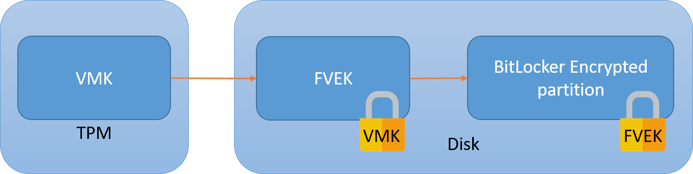

Have you ever been told that the company's data on laptops is protected thanks to BitLocker? Well it turns out that this depends on BitLocker's configuration...

Architecture of a passwordless BitLocker with a discrete TPM
============================================================
The BitLocker partition is encrypted using the Full Volume Encryption Key (FVEK). The FVEK itself is encrypted using the Volume Master Key (VMK) and stored on the disk, next to the encrypted data. This permits key rotations without re-encrypting the whole disk.

The VMK is stored in the TPM. Thus the disk can only be decrypted when booted from this computer (there is a recovery mechanism in Active Directory though).



In order to decrypt the disk, the CPU will ask that the TPM sends the VMK over the SPI bus.

The vulnerability should be obvious: at some point in the boot process, the VMK transits unencrypted between the TPM and the CPU. This means that it can be captured and used to decrypt the disk.

Capturing the TPM exchange
==========================
We'll be using a dirt cheap logic analyzer, [DSLogic Plus](https://www.dreamsourcelab.com/product/dslogic-series/). I bought this for under $100 in 2021 (tax and shipping included).

A note on signal capture: to comfortably acquire a signal the sampling frequency should be 3 to 4 times the bus frequency. This means that for our SPI 33MHz bus we should sample at the very least at 100MHz. Notice that the specs of the analyzer state that it can do *up to* 400MHz on *up to* 16 channels. I'll help you read between the lines here:

* the more channels you capture at a time (by sets of 3), the lower the sampling frequency
* you have to distinguish stream mode and buffer mode. The first one will send results directly to the host computer and permits capture of large sets, up to a minute but it's limited to 100MHz on 3 channels. The buffer mode allows sampling at 400MHz but it will only work for a few milliseconds, so there's no practical use for it here.

This means that this hardware can *barely* do the job we're asking it to do. For a more professional option both hardware and software-wise (but also 10x pricier) have a look at [Saleae](https://usd.saleae.com/products/saleae-logic-pro-16). Otherwise there's [sigrok's list of supported hardware](https://sigrok.org/wiki/Supported_hardware#Logic_analyzers).

As for plugging the analyzer to the board, remember that SPI is a shared bus. This means that there's no need to capture the signal right at the tiny TPM pins if there is a larger SPI component on the board that the hooks can be latched on to. From experience I identified a neighbouring SPI flash, but fortunately all components are marked so it's rather easy to identify their use by looking up their datasheet.


SPI has several lines but only 3 can be captured using the DSLogic because otherwise the sampling frequency drops. The 3 most important ones are the clock CLK and the two data lines MOSI and MISO.

The threshold voltage (level at which the analyzer decides that the line has changed states) should be around half of the signal's voltage, here the latter was measured at 3.3V so an appropriate threshold is around 1.6V.

The VMK key we're looking for is used late in the POST stage. For the Lenovo L13 I worked with it was just after the splash screen, about 14 seconds into the boot process out of a total boot time of about 25 seconds. There are SPI operations before that (mostly to read and verify the early boot stages) but they're not TPM. You could either start the capture when booting the computer, or safely wait about 7 or so seconds to avoid capturing unnecessary data.

Decoding the captured signal
============================
There are 3 layers to decode:

* SPI, which is the physical layer
* TIS
* TPM2.0, which contains the VMK

SPI
---
As far as SPI is concerned any logic analyzer should do this properly, it's a rather simple protocol:


The blue square wave is the clock, the other two lines (yellow and red) are data lines, respectively used for communications from slave to master (MISO) and master to slave (MOSI).

When the clock signal is going up (transitioning from 0 to 1), the bit value is whatever state the data lines are in at this specific time. In our case the red line sits at 0 for 8 clock cycles, so the byte is 0. The yellow line only has the first bit set, so the decoded value is b10000000 = 0x80.

The logic analyzer correctly decodes SPI so we'll just trust its output.

TIS
---
TIS, which stands for TPM Interface Specification, is another beast entirely and that's where I had most of my troubles. I couldn't find a decoder that worked for my capture and decided to do it "manually". Short of correctly decoding the data, the [libsigrock decoders](https://github.com/sigrokproject/libsigrokdecode/pull/88) did at least indicate a rough window for the TPM exchanges which was a welcome tip since each capture has several million bytes of data. Maybe the decoders fail be because the capture is missing Chip Select (CS#) which is required in the TPM specification, maybe because the clock is incorrect, maybe because some bytes are occasionally missing, maybe for some other reason, who knows.

Master to slave request:


Sending a request seems to happen in this order:

* the slave sends byte 80 to signal that it's ready
* the master sends a header we don't care about (```D4 00 24```) and then sends the TPM byte in a loop (```80```)
* the slave acknowledges that it has read the byte by sending 01 FF
* at this point the cycle starts anew with the next byte

So this whole frame is just to send the byte 0x80 from the master to the slave!

Slave to master response:


This is a completely different process that relies on setting and reading registers. The frame is the result of reading one byte from a set address (```D4 00 24```, meaning register 24). Again the slave seems to start the transaction with byte 80, then writes the size of the followong data which is only 1 byte (or it could be an ACK value to the read request, who knows) and finally the value we care about, here 0x80. The next TPM byte is 0x02.

TPM 2.0
-------
The TPM command that requests the key be sent back is the ```TPM2_Unseal``` command. It is described in [part 3 of the TPM 2.0 specification](https://trustedcomputinggroup.org/resource/tpm-library-specification/).

You might ask how I isolated the frames below since no decoder would work. We don't actually care about the requests happening on MOSI, we're mostly interested in the responses on the MISO line. As we've seen previously the TIS encoding around TPM bytes is rather simple, so the simplest way to isolate all TPM transactions is to filter the raw SPI data using the mask "80 00 00 00 01 .." and only keep this wildcard last byte. The start of a TPM transaction can then be identified by its own ```80 01``` or ```80 02``` header. There should only be a few dozens TPM responses, the one with the key inside should be the longer authenticated one (starts with ```80 02```).


There is a 10 milliseconds delay between the unseal command and the response, which is huge. This is probably because the request is authenticated (see below the ```80 02``` header indicating a password session as opposed to most requests using the plain ```80 01``` header) using a HMAC so the slave has to verify the signature and then reply using a HMAC of its own, which induces a notable delay.

The TPM command and its response are obtained by reassembling bytes one by one using the method previously explained.

Reconstituted Unseal command:
```
80 02 00 00 00 5B 00 00 01 5E 80 00 00 00 00 00 00 49 03 00 00 00 00 20 9D F7 05 43 7A 77 AE E4 20 92 66 17 EC DA BB A7 79 D2 47 0D 42 E5 D1 1C EB 4A 6B C1 C8 44 42 BC 00 00 20 D9 AF C7 DF 10 7A D4 30 C1 C5 28 63 5F CE CE 8A 24 1A 19 E5 DD 08 5F 77 AA 28 BE 75 16 16 91 F1
```

Decoded frame using [this awesome tool](https://joholl.github.io/tpmstream-web/):


Response (I've stripped continuation bytes ```1F 00```, they become apparent if you capture several long frames):
```
80 02 00 00 00 81 00 00 00 00 00 00 00 2E 00 2C 2C 00 05 00 01 00 00 00 03 20 00 00 57 61 A3 91 DF E1 B3 85 28 28 C6 DD A6 F9 A5 FE AC E9 71 A4 AA AE 44 25 18 F7 4A A7 FE D6 E0 FC 00 20 8D DD A1 AE 93 5D 98 E9 DA A8 18 6F D5 64 A8 66 E6 DE AA 56 9E 2F 50 A7 41 E1 27 BF A1 2C 4D 92 00 00 20 00 20 BA C9 8F 34 60 5F 4F D4 76 9B 6B AA 68 C7 6C 79 EF 36 7D 1D D3 19 33 78 55 47 B2 E1 40 D4
```

Decoded response:


In the buffer lies our key, it starts with ```5761``` and is 32 bytes long.

Mounting and backdooring the disk
=================================
Mounting the disk live in read/write mode (if you'd rather work offline do a disk copy with dd and then mount this copy using a loop device):
```
echo 5761A391DF1F00E1B3852828C6DDA6F9A5FEACE971A4AAAE442518F74AA7FED6E0FC | xxd -r -p > key
dislocker-fuse -K key /dev/sdd3 ./mnt/
mount ./mnt/dislocker-file ./mnt2/
```

Then the simplest backdoor is to just overwrite the sticky keys program with cmd:
```
cp ./mnt2/Windows/System32/cmd.exe ./mnt2/Windows/System32/sethc.exe
```

Place the disk back in the laptop, boot and press shift 5 times to get a SYSTEM shell:


Limitations
===========
I cannot recommend using the DSLogic for this task:

* a lot of captures were duds and had to be thrown away
* sampling at 3 times the bus speed was barely enough to have a coherent clock and some bytes were missing

This forced me to spend way too much time to understand the protocols in order to decode the capture. In the end time is money, if you're an employer reading this just buy a professional logic analyzer for your employees.

Takeaways
=========
The use of a discrete (physical) TPM actually decreases the security of the system, using a fTPM would solve the problem.

If the discrete TPM has to be used, then a PIN or passphrase on BitLocker is necessary.
