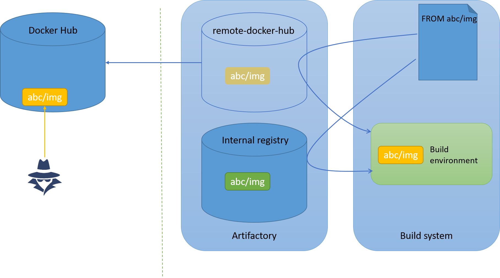

What is a dependency confusion attack?
======================================
A dependency confusion is a supply chain attack where an attacker is able to poison the build by forcing the build system to retrieve his malicious dependency somewhere on the internet instead of the legitimate internal dependency. All dependency confusions emanate from a misconfigured build system.

An organization that doesn't want to publicly publish its packages on the internet is going to use some sort of private repository manager such as [Artifactory](https://jfrog.com/artifactory/) or [Nexus](https://www.sonatype.com/products/sonatype-nexus-repository). Internal projects will publish their packages on a private internal repository.

If everything goes as planned then the dependency is retrieved internally:


If a number of conditions are met then a malicious actor would be able to have his malicious public package pulled instead of the legitimate private package:


Note: Artifactory uses the term "repository" whereas Docker uses the therm "registry". These are functionnaly equivalent in the context of this article.

I'm using Docker, am I affected?
================================
If you don't use Docker private registries then probably not.

If you use Docker mirrors because your organisation has private repositories then read on.

Docker images
=============

Declaring dependencies
-----------------------
Base images are declared at the beginning of the Dockerfile, for instance:
```
FROM alpine
...
```

This is syntactically equivalent to:
```
FROM library/alpine:latest
...
```

Where:

* the registry used is implicitly Docker Hub (hardcoded in the Docker binary)
* ```library``` represents the [namespace or organisation name](https://docs.docker.com/faq/admin/general-faqs/#whats-an-organization-name-or-namespace) containing the official Docker images
* ```latest``` is a tag

Docker mirrors
--------------
As previously mentioned the Docker Hub registry is hardcoded in the Docker binary. This is problematic if an organization does not expose its build systems to the internet (which it shouldn't!). The solution is to use [Docker mirrors]( https://docs.docker.com/docker-hub/mirror/).

The mirrors are declared as a list in the configuration file of the Docker daemon, ```/etc/docker/daemon.json```:
```json
{
    "registry-mirrors": ["https://remote-docker-hub.mydomain.com"]
}
```

The internal docker mirror might for instance be served by Artifactory as a remote repository. Or it could be a simple Docker [Registry](https://hub.docker.com/_/registry).

Vulnerabilities
===============

Mirror resolution order
-----------------------
When several registries are defined as mirrors then the order of declaration matters.

Because the remote registry is declared first, the following ```/etc/docker/daemon.json``` configuration file opens up to a dependency confusion vulnerability:
```json
{
    "registry-mirrors": ["https://remote-docker-hub.mydomain.com", "https://local-docker-project.mydomain.com"]
}
```

Docker will look for the base image on docker hub ```remote-docker-hub``` first, then will fallback to the private registry ```local-docker-project```. This is only exploitable if the project uses internal namespaces because as previously mentioned, failing to provide a namespace would implicitly default to the ```library``` namespace, where only official images are uploaded.

The exploitation is simple enough: create an account on Docker Hub, register the namespace (for instance ```gquere```) and upload the malicious image (for instance ```hello-world```). Then wait until the image is ran and congrats, you've gained a foothold in your target's internal network!

```
docker pull gquere/hello-world
Using default tag: latest
latest: Pulling from gquere/hello-world
04aac19631a0: Pull complete 
Digest: sha256:2bfd53b2487e3a57200c1e3e770e72efea6fd5501272352ad65de5a476e64f8b
Status: Downloaded newer image for gquere/hello-world:latest
docker.io/gquere/hello-world:latest
```

Let's look at the logs:
```
tail -F /var/log/syslog
msg="Calling HEAD /_ping"
msg="Calling POST /v1.43/images/create?fromImage=gquere%2Fhello-world&tag=latest"
msg="Trying to pull gquere/hello-world from http://remote-docker-hub.mydomain.com/"
msg="Fetching manifest from remote" digest="sha256:xxx" error="<nil>" remote="docker.io/gquere/hello-world:latest"
```

The malicious package has indeed been pulled from remote "docker.io".

To sump up, if the following conditions are met then the project is vulnerable:

* two or more mirrors are configured and Docker Hub is declared first
* the project uses one or more namespaces in their internal registry
* this namespace is not registered on Docker Hub

Mixing registries
-----------------
Artifactory virtual repositories can agregate remote and local repositories. These may in turn agregate other repositories.

When mixing repositories, Artifactory tries to prioritize local repositories:


This may however be insufficient is some borderline cases: for instance if a project does not use the tag ```latest``` but forgets to specify a tag in the Dockerfile, then the ```latest``` tag is assumed and fetched from the remote. Admittedly this is a niche case.

Protecting against dependency confusion in Docker
=================================================
The first rule to follow is to never declare the remote registry first in mirrors. If you're using infra as code (you should) then this is easily verified by SAST on your source repository.

Another protection is to only use fully qualified image names: ```docker run <registry>/<namespace>/<image>:<tag>```.
