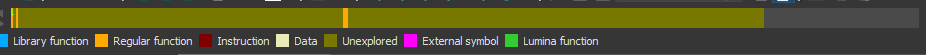
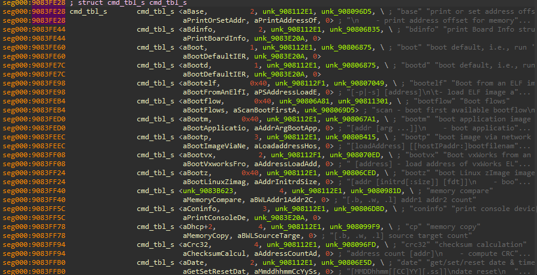
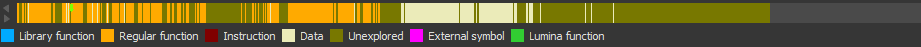
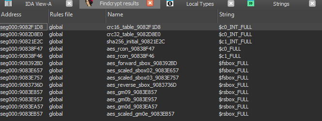
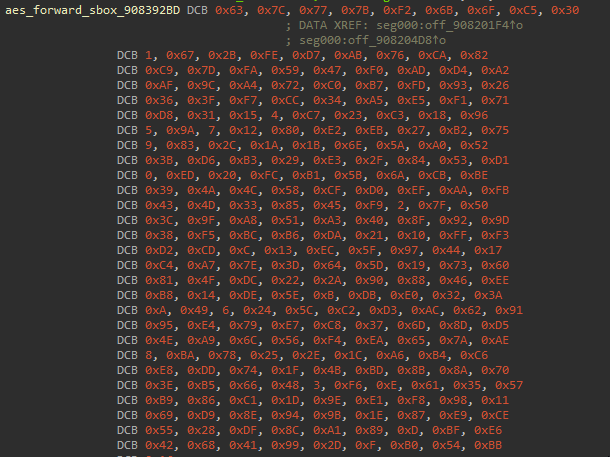
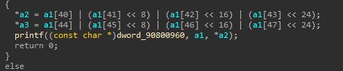
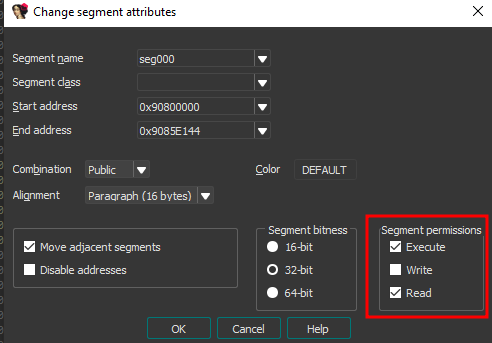
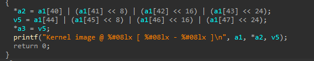

Tip #1: Auto-discovering code
=============================
After it has initialized the necessary peripherals, U-Boot relies on startup scripts to actually decide how to boot. This lets developers load or edit their scripts without having to recompile everything and allows seeing things from a much-appreciated higher-level script language rather than plain C.

The problem for reversers is that this actually creates a split in the code that will make 90% of the codepath unreachable from the main function, which is all that IDA can discover from the reset vector. Thus, this is what IDA leaves you with after you let it auto-discover a new U-Boot project:


The solution is rather straightforward if you know what you're looking for: U-Boot has a table of function pointers for all its high-level script commands; we're going to find this table and instruct IDA to create all the functions it's pointing to.

First, create a structure in the "local types" window:
```c
struct cmd_tbl_s
{
  char *name;
  int maxargs;
  void *(__fastcall *arg_handler)();    // this depends on your U-Boot implementation, sometimes (most times) it's an integer
  int *(__fastcall *cmd)(struct cmd_tbl_s *, int, int, char *const []);
  char *usage;
  char *help;
  int (*complete)(int argc, char *argv[], char last_char, int maxv, char *cmdv[]);
};
```

Finding the table is easy since it's guaranteed to contain pointers to strings representing the actual commands. Go to the "strings" window (SHIFT+F12) and look for the ```base``` command help (this is just one of many commands, we're using this one because the table is sorted alphabetically but we might have used ```bootm``` for instance). Copy the string's address, in my case 0x90831531, and search this sequence of bytes (ALT+B), this will land you somewhere in the table. Depending on the number of commands implemented you might have to go up a bit to find the actual start of the table. Once there define the type (Y) then create an array of the appropriate size (**):

The table of U-Boot command structures when it has been mapped to the address in ROM:


Finally we're going to use this IDA9 script in the script console (SHIFT+F2) to iterate over each structure, creating and naming the function (beware, the API completely changed between 8 and 9):
```python
import idaapi
import ida_typeinf
import ida_funcs
import idc

# Configuration
BASE_ADDR = 0x9083FE28      # e.g., 0x90800000 - Replace with actual table start
NUM_ENTRIES = 73            # Number of command table entries - Adjust as needed
THUMB_MODE = 1              # Set to 0 if no Thumb mode (will fail otherwise)

# Constants
STRUCT_OFFSET_CMD = 0x0C    # Offset to cmd function pointer, should be constant
STRUCT_SIZE = 0x1C          # Size of cmd_tbl_s, should be constant

# Iterate over table entries and create functions
created_count = 0
for i in range(NUM_ENTRIES):
    entry_ea = BASE_ADDR + i * STRUCT_SIZE
    func_ptr_ea = entry_ea + STRUCT_OFFSET_CMD
    func_name = idc.get_strlit_contents(get_wide_dword(entry_ea)).decode('utf-8')

    # Read the function pointer value (32-bit)
    func_addr = idc.get_wide_dword(func_ptr_ea) - THUMB_MODE
    if func_addr == idc.BADADDR or func_addr == 0:
        print(f"Entry {i}: Invalid function pointer at 0x{func_ptr_ea:X} (0x{func_addr:X})")
        continue

    # Create the function if not already one
    if ida_funcs.get_func(func_addr) is None:
        func_success = ida_funcs.add_func(func_addr, -1)  # -1 for auto-end detection
        if func_success:
            print(f"Entry {i}: Function created at 0x{func_addr:X}")
            created_count += 1
        else:
            print(f"Entry {i}: Failed to create function at 0x{func_addr:X}")
            continue

    # Rename the function using its struct name
    idc.set_name(func_addr, "do" + func_name, idaapi.SN_NOWARN)
```

Much better:



WARNING: the script might fail for several reasons having to do with Thumb mode. If your code is NOT Thumb mode then set THUMB_MODE variable to 0; otherwise it will try to use offsets for Thumb mode and fail. If your code is Thumb mode but the section hasn't been defined as T=1 in IDA then you have to do that manually (ALT+G).

Tip #2: Auto-discovering and creating crypto tables
===================================================

Another thing that might help speed up the reversing process is finding hardcoded crypto lookup tables. This is traditionally done using David Berard's findcrypt but the patterns aren't complete and it doesn't create tables so I [forked his project](https://github.com/gquere/findcrypt-yara-autocreate) to do just that. It's mostly the same code but supports full table patterns and autocreates them on the fly.



Isn't that nice?



Tip #3: Why u no printf?
========================

This last one is less of a tip and more of a classic blunder. Sometimes you create a new project, start reversing and find out that Hex-Rays only prints offsets and never points to the actual tables or strings.



Somehow nobody documented the fix to [this problem online](https://reverseengineering.stackexchange.com/questions/18511/ida-hex-rays-decompiler-show-strings-instead-of-offset), which is that your segment is not defined as +R at least (could be +W if you want also):



All fixed now:


