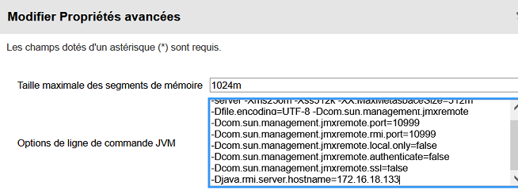

Predictable encryption key
--------------------------
In Informatica version <=10.4 the ```siteKey``` is predictably derived from the domain name and a keyword. This could allow attackers to guess the keyword in order to replicate the siteKey.

This is fixed in versions >=10.5.

Encrypted passwords
-------------------
In all Informatica versions, user passwords are not stored hashed, but encrypted using a key generated at install.

This allows attackers with access to the backend database and the encryption key to [decrypt user passwords](https://www.errno.fr/Informatica.html).

Authenticated remote code execution from the admin panel
--------------------------------------------------------
In all Informatica versions it's possible to use the service feature of the administration panel to edit the Java process' arguments. This can be used to enable JMX:


Once JMX has been activated, remote code execution is achieved by standard means using [beanshooter](https://github.com/qtc-de/beanshooter):

