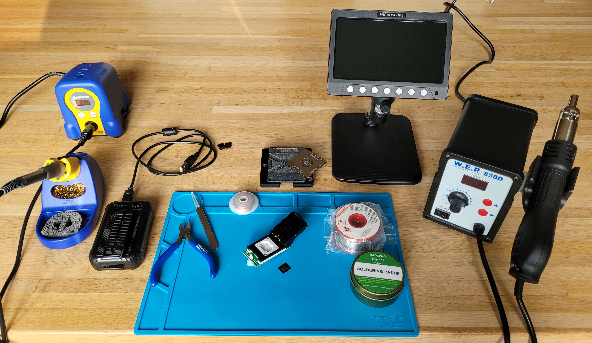
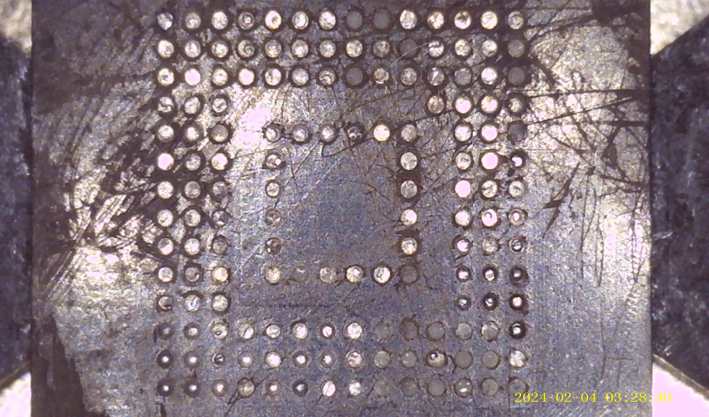
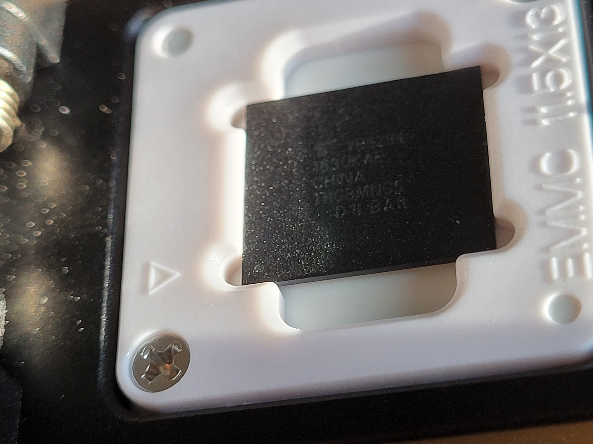
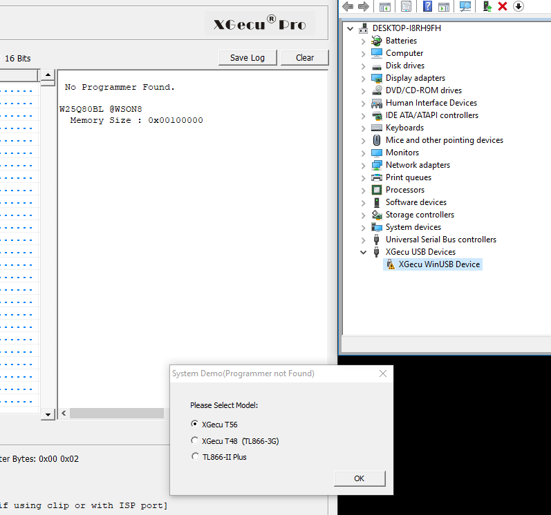
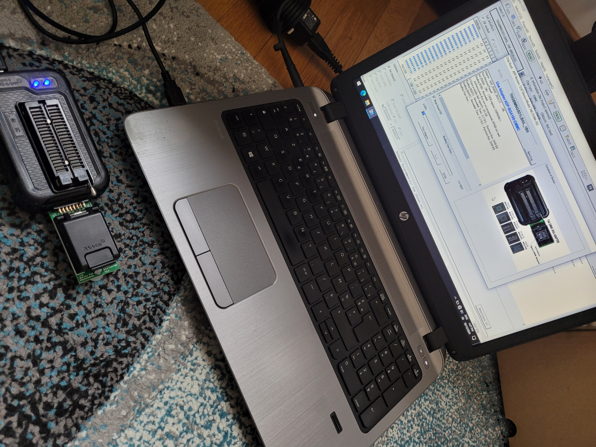
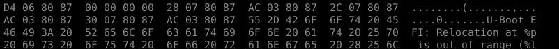
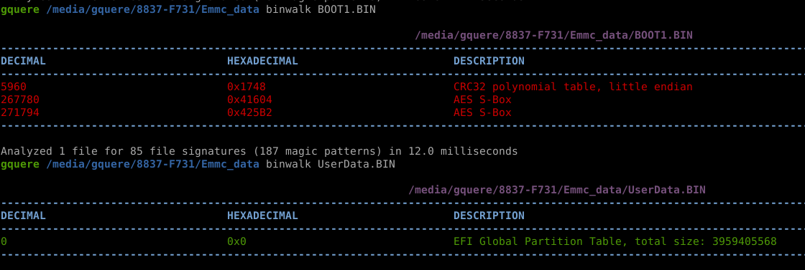

Hardware attacks are becoming cheaper with every passing day for two reasons: first, the cost of the tools is going down and second because there is more documentation available.

Having a vague undestanding of the overall cost metrics of an attack (knowledge, money and time) is a necessary input to perform risk analysis. One might initially assume that a NAND chip-off attack is going to require an expert engineer, a few days of work and an impressive electronics lab and therefore mis-classify vulnerabilities as beyond a certain scope (page 426 of the [Common Criteria Attack Potential](https://www.commoncriteriaportal.org/files/ccfiles/CEMV3.1R5.pdf)).

So how much expertise, time and money do you really need to perform a chip-off attack on a BGA NAND nowadays? Well I tried it and the expertise required is not impressive, the time was literally 30 minutes and the total cost was 170.87 euros with quite a lot of room for optimization.

The tools
=========

These are the tools used for the attack:

* A 1200x digital microscope with integrated display: 30.19€
* A 858D hot air station: 35.95€
* An official XGecu T46 programmer and a BGA153 adapter: 96.33€
* Some flux, better grab it in a tube for easier application: 1.76€
* Low temperature reballing solder paste: 2.78€
* A reballing BGA153 stencil: 2.53€
* A roll of solder wick: 1.29€
* A mat to protect the family dining table: priceless

If strapped for cash some components can be ignored and a XGecu clone could help bring the price down to about 100€ total.

The attack
==========

Apply a liberal amount of flux to the targeted zone. I've started heating the surroundings at 280°C for about a minute, then cranked up the heat to 350°C. The exact numbers don't mean much because your hot air station will differ, you'll use another nozzle size and the distance from which you'll blow the air will be different also. But start on the low end to distribute the heat to all nearby components and then increase the temperature until the solder melts and becomes shiny, which might take 2-3 more minutes. Re-add some flux periodically when it's been vaporized or blown away. This process can be sped up significantly by using a heating plate to pre-heat the board.

Do not try to pry the chip off, this will undoubtedly rip some pads off and might permanently kill the board and the flash. Trust the process, push the chip gently on the side and it will eventually float off when all the solder balls have melted, at which point it's easy to pull it with tweezers.

If some of the solder balls have melted together and formed blobs on the underside of chip they will need to be removed using solder wick. But in any case it's still a good practice not to skip this step. Clean the old flux using isopropyl alcohol, apply new flux and drag a strip of wick accross the chip using a soldering iron until no more bumps/grits are felt on the chip. If you have leaded solder lying around (you should!) it's always easier to add some to the area you're trying to clean because it has a lower melting point and better viscosity. It will mix with the old RoHS-compliant solder and it makes the cleaning process much easier.

At this point you should have a chip looking more or so like this, I've scratched mine quite a lot when cleaning it with the wick but that's no big deal:

Lets put it in the XGecu T48 reader. On the chip there is a dot in a corner which indicates pin 1, it's barely visible on the picture but it's there! This dot should be aligned with the arrow inside the socket:

I don't really trust the software provided with the T48. I've had no success attaching the reader to a virtual machine, the driver didn't seem to work in the VM and the XGecu was appearing with an error (yellow triangle) in Windows' device manager. So I just used an offline laptop that never connects to the internet. Otherwise there is this cool open source project which I haven't tried yet: [minipro by David Griffith](https://gitlab.com/DavidGriffith/minipro) but it seems like he's mostly focused on older readers for now with support for the T46/56 being marked as experimental.

This is what it looks like if no programmer is detected (that's bad):

Otherwise there's not a lot to do, I've only had to select my chip in the list, then hit read. Of course 4-bit mode will be faster than 1-bit mode :)

The measure of success is a parsable dump and a U-Boot string \o/

Where to go from here
=====================

At this point we've basically (maybe) only recovered the firmware of the target. This might be considered to be a vulnerability in and of itself and it is tremendously useful as it enables us to find secrets, reverse engineer the produt, identify and exploit vulnerabilities. But we haven't properly achieved RCE yet.

The next step will depend on the firmware recovered:

* If it's not cryptographically signed (encrypted in the context is a form of signature) then it's possible to simply alter the bootloader or the filesystem to recover a shell at any point.
* If it is partially signed and encrypted, say if the bootloader, kernel and the main RO filesystem are signed but there are additional RW partitions that are not encrypted then it's sometimes possible to achieve remote code execution by modyfying the contents of said partitions: a script, [a configuration file](https://www.rsyslog.com/doc/configuration/modules/omprog.html) or even a data file if a vulnerability is found in its parser.
* If everything is properly signed, then the meaning of "properly" can be challenged. I've found a number of vulnerabilities in custom secure boot implementations by simply reading precisely what they were actually doing and identifying corner cases that could be abused.

After a vulnerability has been identified, it could be necessary to modify the flash's contents and solder it back to the target. Unfortunately my solder paste seems to have lost by the carrier. This might be covered in a part two later on.
