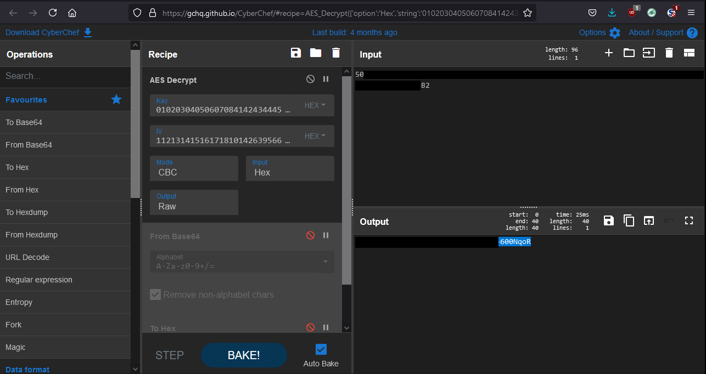

Patrol's [default configuration](https://docs.bmc.com/docs/PATROLAgent/107/securing-patrol-agent-from-the-pconfig-clients-655597337.html) permits remote configuration reads:


The configuration is remotely queried using the ```pconfig``` binary. The configuration contains the encrypted password of the local Patrol user:


All Patrol instances before update 22.1.00 [use a default encryption key](https://gist.github.com/gquere/045638b9959f4b3e119ea01d8d6ff856).

Thus the password of the Patrol account can be decrypted:


A valid Patrol account can be used to authenticate to the service and remotely execute code:


## Editor response
According to the editor this is not a vulnerability.
