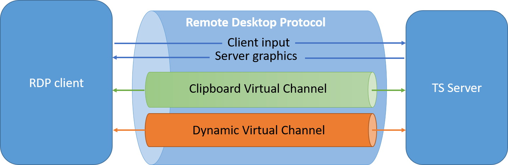

Sometimes life gives you lemons. And sometimes life gives you port 3389 only.

During a recent pentest at a client, I was provided with a jump host in a DMZ with some tight firewall rules. Only port 3389 (RDP) could be seen on the jump host, and no reverse shell was possible from the jump host to my laptop. Also I didn't have elevated privileges on this host, as things should be. OK I lied, I privesced the jump host, but it's not useful anyways so let's ignore that. So where to go from there?

Well, turns out there's a nice lesser known feature of Windows' Terminal Services (aka Remote Desktop Services) called Dynamic Virtual Channels.

Virtual Channels enable the tunneling of arbitrary packets inside the RDP connection by tagging packets according to the desired source/destination. These channels are used for instance to transfer clipboard data between hosts.



But according to the [documentation](https://docs.microsoft.com/en-us/windows/win32/termserv/dvc-implementation-details) one can define his own tunnel by providing a custom DLL to the RDP client and running a custom SOCKS5 proxy server on the remote jump host that doesn't even require SYSTEM privileges!

Here are two projects that do just that, one for Windows clients and one for Linux hosts.


From Windows
============

Use [SocksOverRdp](https://github.com/nccgroup/SocksOverRDP).

Needed files
------------
Needed binaries are already compiled in a release archive: [https://github.com/nccgroup/SocksOverRDP/releases](https://github.com/nccgroup/SocksOverRDP/releases)
```
SocksOverRDP-Plugin.dll
SocksOverRDP-Server.exe
```

Usage
-----
Check the project's [README](https://github.com/nccgroup/SocksOverRDP/blob/master/README.md) for complete instructions.

On windows host, register the DLL:
```
regsvr32.exe SocksOverRDP-Plugin.dll
```

Then RDP to the server:
```
mstsc.exe
```

On windows server, run the binary as an unprivileged user:
```
SocksOverRDP-Server.exe
```

The SOCKS5 server is then available at 127.0.0.1:1080:
```
ncat.exe --proxy 127.0.0.1:1080 --proxy-type socks5 REMOTECOMPUTER 22
```

From Linux
==========

Use xfreerdp (should be installed on your Kali or available from any decent package manager) and [rdp2tcp](https://github.com/V-E-O/rdp2tcp).

Cross-compile the Windows server
--------------------------------
```
apt install mingw-w64
make server-mingw32
```

Compile the Linux client
------------------------
```
make client
```

Needed files
------------
```
./client/rdp2tcp
./server/rdp2tcp.exe
./tools/rdp2tcp.py
```

Usage
-----
On Linux host:
```
xfreerdp /d:DOMAIN /u:USER /p:PASSWORD /v:COMPUTER:PORT /rdp2tcp:/path/to/rdp2tcp
```

Then on Windows host, as an unprivileged user:
```
rdp2tcp.exe
```

Then on Linux host:
```
echo "socks5 127.0.0.1 1080" >> /etc/proxychains.conf
rdp2tcp.py add socks5 127.0.0.1 1080
```

Then use standard commands with proxychains:
```
proxychains nc -z -v REMOTECOMPUTER 22
```

That's it. Happy pentesting!
