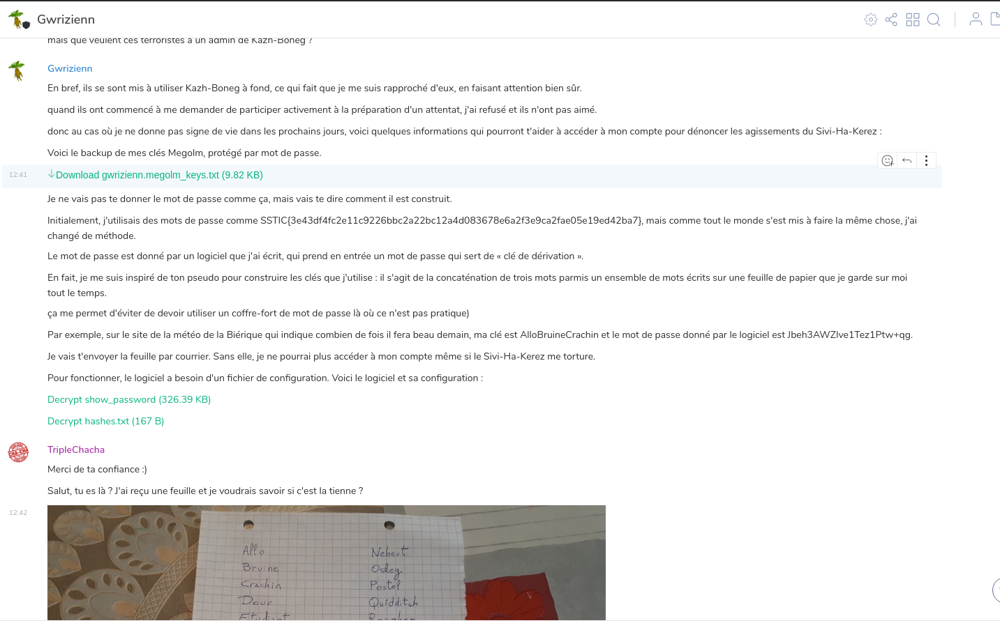

Challenge Information
---------------------

* Challenge type: Forensics ... kinda?
* Rating: Easy    2-3 hours

Installing Matrix-Synapse
-------------------------
We've previously recovered a PostgreSQL dump and a file archive.

Looking into the database we can conclude it's a [matrix-synapse](https://github.com/matrix-org/synapse) dump.

We'll need to install it and import the database.

I didn't take notes of the installations process, I simply followed the [installation instructions](https://github.com/matrix-org/synapse/blob/master/INSTALL.md) then configured it to use psql according to [this documentation](https://github.com/matrix-org/synapse/blob/master/docs/postgres.md).

I didn't want to crack the users passwords because it's bcrypt with a work factor of 10 and I know better than trying to run even the simplest of dictionnaries on my antique machine, so I just replaced them all with a hash I generated:
```
postgres=# UPDATE users SET password_hash = '$2a$10$3TIGn2nHyXMo.oIgm9YPreFlVor2pz0tPGdX/Xsj0OcmMT0GQJfmm' WHERE 1=1;
```

Then we're ready to start!

Starting the investigation
--------------------------
Let's just log as anyone on the server, and look at the main unencrypted chat room:


TripleChaCha and Gwrizienn seem to have exchanged keys to a room and talked together in private. Let's investigate.



The flag ```SSTIC{3e43df4fc2e11c9226bbc2a22bc12a4d083678e6a2f3e9ca2fae05e19ed42ba7}``` validates step2 and confirms we're on the right track!

From now on, all flags will be used as the passwords to import users' [Matrix megolm keys](https://matrix.org/docs/guides/end-to-end-encryption-implementation-guide/). This was a really fun way to self-contain all flags into the initial challenge archive; congrats to the authors on this one, it made the hunting quite playful!

Next part: [step 3](./step3)
