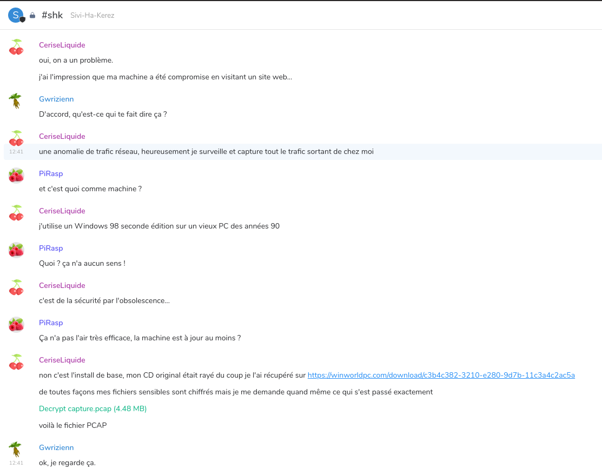

Challenge information
=====================

* Challenge type: Reverse
* Rating: Easy    2h
* Challenge inputs:
    * a file containing some sort of hashes
    * a text wordlist of 26 entries
    * a linux binary ```show_password```


Getting the hash
================

Per the instructions we need to find the 3-words password from the wordlist that somehow recovers the chat password using the provided binary.

The hashes file looks like it is (somewhat) (badly) encrypted. We can barely distinguish that it's a hashing algorithm with a salt and a work factor:
```
meteo:$sstic$ad6w.742e=#1!2=&$t/3?v0.,ebYY_F}QSWYWDfDIuYB@oj2Jc*XqIE{zOwEzDtqCFhj^q
chat:$sstic$ad6w.742e=#1!2=&$t/3?v0.,SzfPIDt~VhWXr]SCECfv5j2rZeob2Z.@4^pgqdU[AGMBW
```

The simplest way of getting the password is to just let it bruteforce from the wordlist. After all there are only 26^3 combinations to try!

We've got a toy example to get a sense of the timings:
```bash
time ./show_password hashes.txt meteo
Password for meteo: AlloBruineCrachin
Good password ☀
Welcome ☺
Your password is Jbeh3AWZIve1Tez1Ptw+qg

real	0m6,295s
user	0m16,262s
sys	0m1,019s

time ./show_password hashes.txt meteo
Password for meteo: abc
Wrong password‽

real	1m6,133s
user	2m52,369s
sys	0m12,282s
```

Uh oh... seems like my CPU is way too weak to solve this challenge this way: a success takes more than 6 seconds and it doesn't have enough cores to meaningfully parallelize. So this approach would take a bunch of hours to complete...

Another problem is that ```show_password``` is a Rust binary, which are a notorious mess to reverse. I really didn't want to do that. So I first loaded it in gdb and looked at the functions:
```
argon2::argon2::hash_encoded
argon2::argon2::verify_encoded_ext
argon2::argon2::verify_raw
argon2::variant::Variant::from_str
```

Hey Argon2, that's kinda what I was expecting! Let's set a breakpoint in gdb (kitted with [gef](https://github.com/hugsy/gef)) and do a test run:
```
gef➤  b argon2::argon2::verify_encoded_ext
Breakpoint 3 at 0x555555562b90
gef➤  run hashes.txt chat
Starting program: /sstic2020/step3/synapse_data/show_password hashes.txt chat
[Thread debugging using libthread_db enabled]
Using host libthread_db library "/lib/x86_64-linux-gnu/libthread_db.so.1".
Password for chat: abc

Breakpoint 3, 0x0000555555562b90 in argon2::argon2::verify_encoded_ext ()
[ Legend: Modified register | Code | Heap | Stack | String ]
────────────────────────────────────────────────────────────────────────────────────────────────────────────────────────────────────────────────────────────────────────────────────────────── registers ────
$rax   : 0x0               
$rbx   : 0x00007fffffffd9c0  →  0x00005555557a6b40  →  0x0000000000000001
$rcx   : 0x3               
$rdx   : 0x00005555557aaf40  →  0x000000000a636261 ("abc\n"?)
$rsp   : 0x00007fffffffd928  →  0x0000555555562b88  →   add rsp, 0x10
$rbp   : 0x00005555557a8d30  →  "$argon2id$v=19$m=102400,t=2,p=8$ShgCOIbvVzVKtPEKEQ[...]"
$rsi   : 0x4d              
$rdi   : 0x00005555557a8d30  →  "$argon2id$v=19$m=102400,t=2,p=8$ShgCOIbvVzVKtPEKEQ[...]"
$rip   : 0x0000555555562b90  →  <argon2::argon2::verify_encoded_ext+0> push rbp
$r8    : 0x0000555555593782  →   add BYTE PTR [rax], al
$r9    : 0x0               
$r10   : 0x0000555555598891  →   add BYTE PTR [rax], al
$r11   : 0x246             
$r12   : 0x0               
$r13   : 0x0000555555570600  →   push r15
$r14   : 0x4d              
$r15   : 0x0000555555562b70  →   push rax
$eflags: [zero carry parity adjust sign trap INTERRUPT direction overflow resume virtualx86 identification]
$cs: 0x0033 $ss: 0x002b $ds: 0x0000 $es: 0x0000 $fs: 0x0000 $gs: 0x0000 
────────────────────────────────────────────────────────────────────────────────────────────────────────────────────────────────────────────────────────────────────────────────────────────────── stack ────
0x00007fffffffd928│+0x0000: 0x0000555555562b88  →   add rsp, 0x10	 ← $rsp
0x00007fffffffd930│+0x0008: 0x0000555555593782  →   add BYTE PTR [rax], al
0x00007fffffffd938│+0x0010: 0x0000000000000000
0x00007fffffffd940│+0x0018: 0x0000000000000000
0x00007fffffffd948│+0x0020: 0x0000555555560570  →   test al, 0x1
0x00007fffffffd950│+0x0028: 0x00007fffffffda03  →  0x00000100007fffff
0x00007fffffffd958│+0x0030: 0x000055555555fe00  →   mov rdx, rsi
0x00007fffffffd960│+0x0038: 0x00005555555933ac  →  ":Error: unexpected line in hashes ()\nstr::from_ut[...]"
──────────────────────────────────────────────────────────────────────────────────────────────────────────────────────────────────────────────────────────────────────────────────────────── code:x86:64 ────
   0x555555562b8b                  adc    BYTE PTR [rcx+rax*1], ah
   0x555555562b8e                  pop    rcx
   0x555555562b8f                  ret    
 → 0x555555562b90 <argon2::argon2::verify_encoded_ext+0> push   rbp
   0x555555562b91 <argon2::argon2::verify_encoded_ext+1> push   r15
   0x555555562b93 <argon2::argon2::verify_encoded_ext+3> push   r14
   0x555555562b95 <argon2::argon2::verify_encoded_ext+5> push   r13
   0x555555562b97 <argon2::argon2::verify_encoded_ext+7> push   r12
   0x555555562b99 <argon2::argon2::verify_encoded_ext+9> push   rbx
──────────────────────────────────────────────────────────────────────────────────────────────────────────────────────────────────────────────────────────────────────────────────────────────── threads ────
[#0] Id 1, Name: "show_password", stopped 0x555555562b90 in argon2::argon2::verify_encoded_ext (), reason: BREAKPOINT
────────────────────────────────────────────────────────────────────────────────────────────────────────────────────────────────────────────────────────────────────────────────────────────────── trace ────
[#0] 0x555555562b90 → argon2::argon2::verify_encoded_ext()
[#1] 0x555555562b88 → add rsp, 0x10
[#2] 0x555555593782 → add BYTE PTR [rax], al
─────────────────────────────────────────────────────────────────────────────────────────────────────────────────────────────────────────────────────────────────────────────────────────────────────────────
gef➤  x/s $rbp
0x5555557a8d30:	"$argon2id$v=19$m=102400,t=2,p=8$ShgCOIbvVzVKtPEKEQge3g$zZwnq4W8H4LqtwiCSAULQQ"
```

Got myself a cleartext hash! Surely this will save me some computing time!

Cracking the hash
=================

Let's plug the recovered hash in a script to bruteforce the password:
```python
#!/usr/bin/env python3
import argon2
import base64

with open('wordlist', 'r') as f:
    words = f.readlines()

for word1 in words:
    for word2 in words:
        for word3 in words:
            password = '{}{}{}'.format(word1.strip(), word2.strip(), word3.strip()).encode('utf-8')
            password_hash = argon2.low_level.hash_secret(password, salt=base64.b64decode('ShgCOIbvVzVKtPEKEQge3g=='), time_cost=2, memory_cost=102400, parallelism=8, hash_len=16, type=argon2.low_level.Type.ID, version=19)
            if password_hash == b'$argon2id$v=19$m=102400,t=2,p=8$ShgCOIbvVzVKtPEKEQge3g$zZwnq4W8H4LqtwiCSAULQQ':
                print(password)
                exit(0)
```

This bruteforce recovered the correct 3-words password in about 20 minutes, which is miles better than the 8 hours initially expected!

All that's left is to get the flag:
```
./show_password hashes.txt chat
Password for chat: OskegLukachennMabig
Good password ☀
Welcome ☺
Your password is SSTIC{556c34304f6279736e516f3267794e4963637a637051}
```

We can import Gwrzienn's Megolm key using this password, and this gives us access to another room conversation:



All that we've got to start is a PCAP file and ... a windows 98 tip. Buckle up, for the next one is a beast.

Next part: [step 4](./step4)
