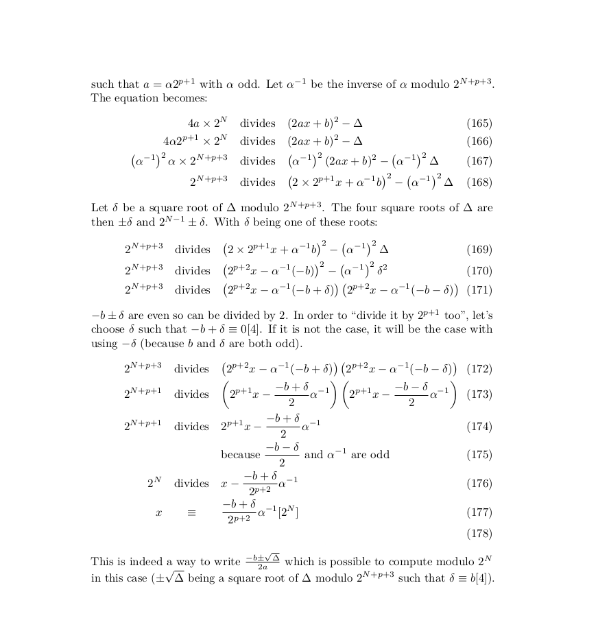

Challenge information
=====================
* Challenge type: Reverse
* Rating: Hard    20-30 hours
* Challenge inputs:
** a 64-bits ELF binary ```alaide``` and some explanations surrounding it, namely that it's a smartcontract provider
** some sort of memory dump ```contract_memory.txt``` reproduced below
** the next megolm key dump ```fraiseglacee.megolm_keys.txt```
** a link to a mathematics paper on the subject of modular arithmetics

The contract memory dump looks like this (rearranged using a rule I'll describe afterwards):

```
Memory slot 0000000000000000000000000000000000000000000000000000000000000000 = 0000000099EB8BB96FF8580A5245205230305421B42CC50912EA778600000020
Memory slot A6EEF7E35ABE7026729641147F7915573C7E97B47EFA546F5F6E3230263BCB49 = 00000000000000000000000000000000BD77247EFD5026120EC466DC0BF48F78
Memory slot CC69885FDA6BCC1A4ACE058B4A62BF5E179EA78FD58A1CCD71C22CC9B688792F = 0000000000000000000000000000000042D91B8FD115E27863C53462655BCA4B
Memory slot D9D16D34FFB15BA3A3D852F0D403E2CE1D691FB54DE27AC87CD2F993F3EC330F = 000000000000000000000000000000002D4B53BD572BC0E509147E49720F2DBB
Memory slot 7DFE757ECD65CBD7922A9C0161E935DD7FDBCC0E999689C7D31633896B1FC60B = 000000000000000000000000000000009B0656AF78A7CCC5FA58ECE282AFB5BC
Memory slot EDC95719E9A3B28DD8E80877CB5880A9BE7DE1A13FC8B05E7999683B6B567643 = 000000000000000000000000000000009A58B3845230BCCDA2D68691B0F85CD3
Memory slot E2689CD4A84E23AD2F564004F1C9013E9589D260BDE6380ABA3CA7E09E4DF40C = 000000000000000000000000000000007AACC07CC54BE008851A06A6882974D4
Memory slot 8F331ABE73332F95A25873E8B430885974C0409691F89D643119A11623A7924A = 0000000000000000000000000000000010D4DBA09B5D1C148B11EFF397A19205
Memory slot DC686EC4A0FF239C70E7C7C36E8F853ECED3BC8618F48D2B816DA2A74311237E = 000000000000000000000000000000003D66028DE2A301537EB6A37E0A7D9578
Memory slot 4DB623E5C4870B62D3FC9B4E8F893A1A77627D75AB45D9FF7E56BA19564AF99B = 00000000000000000000000000000000EB0BA52C2D94D5E994A0FD02953CA525
Memory slot 74A5FBCB419AB7DBACBB2C92A4E163730F0DA5C72B911DEECF4F05A6B327D0A4 = 00000000000000000000000000000000BFF717B395416071B54CD1E19274B4D8
Memory slot 2A32391A76C35A36352B711F9152C0D0A340CD686850C8EF25FBB11C71B89E7B = 0000000000000000000000000000000009BD86249E977C79655D20569DCD3571
Memory slot FC80CD5FE514767BC6E66EC558E68A5429EA70B50FA6CAA3B53FC9278E918632 = 00000000000000000000000000000000858E2D7034EA8DBDA7097DDF36428E2A
Memory slot 23BF72DF16F8335BE9A3EDDFB5EF1C739B12847D13A384EC83F578699D38EB89 = 0000000000000000000000000000000090650EDF445FD692FAEC1AE30936F9C4
Memory slot 86B3FA87EE245373978E0D2D334DBDE866C9B8B039036B87C5EB2FD89BCB6BAB = 00000000000000000000000000000000D6F457E826D92CD3B122417D728927B3
Memory slot 57AAAFA65C4E563D39FFF90096A5FA76D42117F53D87EF870784E64D63A8A16B = 0000000000000000000000000000000075863546676FC6615A15F2C6C09F4933
Memory slot 12BD632FF333B55931F9F8BDA8B4ED27E86687F88C95871969D72474FB428C14 = 00000000000000000000000000000000AC530B4036B0AFCD3E21EA92B858F6A9
Memory slot 755311B9E2CEE471A91B161CCC5DEED933D844B5AF2B885543CC3C04EB640983 = 000000000000000000000000000000009189E739289CEA74276B13D26DBE09B4
Memory slot C8D233A0EBEF7C9A17D2B0B17EEA62CCA39002A128CCF419119B4A1A1F1E7428 = 000000000000000000000000000000005BDDAAE22D5F3DA9B536582CB9A17298
Memory slot 40165E7164257B249280BF839A50283D248062ED7B0E6D8820CB6C506BFCF7D3 = 00000000000000000000000000000000BCE46085EA23920E095E54F51316397F
Memory slot 41CB80F82BADDDD72E38FDA86A7CBBA38FAFD9735EF98C7795ABBBAF2B149562 = 00000000000000000000000000000000D7D98A01C0DFE62BB863FD73F98EBE62
Memory slot 467A5C61216CAD3003BC3395C339807C735D5C3D989CA4BC0EF2A37E14CE2679 = 0000000000000000000000000000000045884FAA578E3CA131CBEF423EA3F68C
Memory slot 4E788733FE0BFF9AF5F3E3A353367490C603293E53707FE7E4E0071B9ED497D6 = 00000000000000000000000000000000BB8476D9103C116AF663106A9E2DB2F4
Memory slot 2B00120B81607971383F6F5676C1551D6BB27BE3F263689FD3630E1A5BE14018 = 000000000000000000000000000000008B656CF9792301C29A786BAD639C3919
Memory slot BDBFD5FE12B0725F9A86EFFBF0320821EB71455F8B2A1271FAE01B3621E6F172 = 000000000000000000000000000000003BD1AF68A64ADFA69329E9995FFE9C37
Memory slot 80F14989282B60FA53CDD4F20DDDF40419D0398091709CCEEF4EA6608CB53A86 = 00000000000000000000000000000000348912D16CDFF19B53632544E24155CC
Memory slot 2480FE25EE21F0B2BC289CCFF6DF415947190B288094AB9F0CBD50F7B814FD5E = 00000000000000000000000000000000C1E6D58E626E0B544310B623021C4E9F
Memory slot DDD2ED02835F51D041D738F145BF914E284838547C9BCC952EA4F9DE82C9F093 = 000000000000000000000000000000000DF3FD6B4949300E52D624E02E1DCEB0
Memory slot D6E773D900EC812417038DA9BAF6D960FCC201DD4BFA0D6323C29C7F6D7D874A = 0000000000000000000000000000000038095B8DCA7F3080760F2E79D4DEAD87
Memory slot 02D9F8353BCA53BC9B195AA186AB6D98B49A9120C00257EE2C7D860C26F864EA = 0000000000000000000000000000000050B94C75C93671A2CE180634059D9800
Memory slot 31FF9DA46623DED696608610C3749320B1CB2C2DFD644B1139DA5367A8E616CF = 000000000000000000000000000000005790098E78097C66F47F1833A8329758
Memory slot 68FB8E7CAD479CCC9244A179D64897454189FD25DB04E15D3A5135327A17597B = 0000000000000000000000000000000098F6D5A0E9039AF0B549FBED480C324C
Memory slot AF2AFAF35AD6DA1368C28C91BA52A84B6FC26E5AA0D9B26DC4FA0373E4D12C30 = 0000000000000000000000000000000039426851D22DDF6C6D3DD9627DE11F8C
```

Running the binary after reading its help menu gives us this output:

```
 gquere@sandbox  ~/sstic2020/step6  ./alaide local ABCD
Deploying...
Smart contract has been deployed.
Sending message part 1/32 ...
[ .. snip .. ]
Sending message part 32/32 ...
Contract memory is now :
Memory slot 755311B9E2CEE471A91B161CCC5DEED933D844B5AF2B885543CC3C04EB640983 = 000000000000000000000000000000007C931ACB5FBC85C657EE1082D986C5A8
Memory slot 68FB8E7CAD479CCC9244A179D64897454189FD25DB04E15D3A5135327A17597B = 00000000000000000000000000000000ECDBCA6DBE4D33EC06B2E94E88350EA2
Memory slot A6EEF7E35ABE7026729641147F7915573C7E97B47EFA546F5F6E3230263BCB49 = 000000000000000000000000000000003CFC328DD57D2BDE3366197B4646A879
Memory slot 02D9F8353BCA53BC9B195AA186AB6D98B49A9120C00257EE2C7D860C26F864EA = 00000000000000000000000000000000BF91C7129CA8CE64393B907FD78B194B
Memory slot 74A5FBCB419AB7DBACBB2C92A4E163730F0DA5C72B911DEECF4F05A6B327D0A4 = 0000000000000000000000000000000048464173B66F5F7592ECE3955BE9CCA5
Memory slot 86B3FA87EE245373978E0D2D334DBDE866C9B8B039036B87C5EB2FD89BCB6BAB = 000000000000000000000000000000005D0D45E23BABEFCAEA1128F9C88F8DA0
Memory slot 0000000000000000000000000000000000000000000000000000000000000000 = 00000000272FDF9C7ADD35BE52452052303054216F364CC206A6EA5500000020
Memory slot 467A5C61216CAD3003BC3395C339807C735D5C3D989CA4BC0EF2A37E14CE2679 = 0000000000000000000000000000000034CD8D3A423DCF5DD5ABEDC53E7E38D5
Memory slot AF2AFAF35AD6DA1368C28C91BA52A84B6FC26E5AA0D9B26DC4FA0373E4D12C30 = 000000000000000000000000000000003381AA029B6E142AE55743BC848D1DD8
Memory slot 31FF9DA46623DED696608610C3749320B1CB2C2DFD644B1139DA5367A8E616CF = 00000000000000000000000000000000D7366BCF76FA3D191918E77A5AA33004
Memory slot 4E788733FE0BFF9AF5F3E3A353367490C603293E53707FE7E4E0071B9ED497D6 = 000000000000000000000000000000007653381F843B53B934E690B1B86527D1
Memory slot 80F14989282B60FA53CDD4F20DDDF40419D0398091709CCEEF4EA6608CB53A86 = 0000000000000000000000000000000019E8FF28032DB30ACE466643BEC4998B
Memory slot CC69885FDA6BCC1A4ACE058B4A62BF5E179EA78FD58A1CCD71C22CC9B688792F = 000000000000000000000000000000007A82B6FD90C25AE6397B13A15DADF17B
Memory slot C8D233A0EBEF7C9A17D2B0B17EEA62CCA39002A128CCF419119B4A1A1F1E7428 = 0000000000000000000000000000000022439E74A04276B9BB4E5601EB2DB215
Memory slot BDBFD5FE12B0725F9A86EFFBF0320821EB71455F8B2A1271FAE01B3621E6F172 = 000000000000000000000000000000005A06BE67B9E8ADF57C687485768B90B8
Memory slot EDC95719E9A3B28DD8E80877CB5880A9BE7DE1A13FC8B05E7999683B6B567643 = 000000000000000000000000000000003581D0421AE07A2AB2BD85F4F2320BD8
Memory slot 41CB80F82BADDDD72E38FDA86A7CBBA38FAFD9735EF98C7795ABBBAF2B149562 = 00000000000000000000000000000000AA803DF0BC9686589D0844FC64C2CBBF
Memory slot 7DFE757ECD65CBD7922A9C0161E935DD7FDBCC0E999689C7D31633896B1FC60B = 000000000000000000000000000000009EA9E9C1375D1A0A3716E2B55A3D5285
Memory slot D6E773D900EC812417038DA9BAF6D960FCC201DD4BFA0D6323C29C7F6D7D874A = 0000000000000000000000000000000069DD2DBE1699BBCD0DCEAA80A36861AA
Memory slot 2480FE25EE21F0B2BC289CCFF6DF415947190B288094AB9F0CBD50F7B814FD5E = 00000000000000000000000000000000D7A55C635FA288DDECA5B4389E8932C5
Memory slot 8F331ABE73332F95A25873E8B430885974C0409691F89D643119A11623A7924A = 00000000000000000000000000000000310DDA8BA4D94578CBC67AC02CA204F0
Memory slot 57AAAFA65C4E563D39FFF90096A5FA76D42117F53D87EF870784E64D63A8A16B = 0000000000000000000000000000000073A57BD8F6399716D7663365887CAB95
Memory slot D9D16D34FFB15BA3A3D852F0D403E2CE1D691FB54DE27AC87CD2F993F3EC330F = 00000000000000000000000000000000362506467ED20D4697FC652AA3E688DC
Memory slot E2689CD4A84E23AD2F564004F1C9013E9589D260BDE6380ABA3CA7E09E4DF40C = 00000000000000000000000000000000E5A8DB6C551B6758AA3C9918C521F0D6
Memory slot 23BF72DF16F8335BE9A3EDDFB5EF1C739B12847D13A384EC83F578699D38EB89 = 0000000000000000000000000000000095C69136C99B1C84803121F15E0AA8CD
Memory slot 40165E7164257B249280BF839A50283D248062ED7B0E6D8820CB6C506BFCF7D3 = 00000000000000000000000000000000D835A3970BBD918711AD267523D17CD1
Memory slot FC80CD5FE514767BC6E66EC558E68A5429EA70B50FA6CAA3B53FC9278E918632 = 0000000000000000000000000000000064D09A1BE191CD106D4AD026BC0A9441
Memory slot 12BD632FF333B55931F9F8BDA8B4ED27E86687F88C95871969D72474FB428C14 = 0000000000000000000000000000000094997AC1F60849F1CEC708E73A098FF5
Memory slot 4DB623E5C4870B62D3FC9B4E8F893A1A77627D75AB45D9FF7E56BA19564AF99B = 0000000000000000000000000000000028F5DDB419103AA4A6C25C03ADB2CD3F
Memory slot DC686EC4A0FF239C70E7C7C36E8F853ECED3BC8618F48D2B816DA2A74311237E = 000000000000000000000000000000008F4B6506CF7BA43CB07DBB6D6460D75B
Memory slot DDD2ED02835F51D041D738F145BF914E284838547C9BCC952EA4F9DE82C9F093 = 00000000000000000000000000000000C2A636C0FFB5CDBFBD13D14F99F780F1
Memory slot 2A32391A76C35A36352B711F9152C0D0A340CD686850C8EF25FBB11C71B89E7B = 000000000000000000000000000000005EEAC15DF4B21FE16933CC1FA2054EBE
Memory slot 2B00120B81607971383F6F5676C1551D6BB27BE3F263689FD3630E1A5BE14018 = 000000000000000000000000000000009D6B52891F4F8B7444C8E873168D8C8F
Done.
```

Alright so we can conclude that the ```contract_memory.txt``` we've been given is a sample output of the program. It's intuitive that we need to recover the input message given the blockchain's memory.

After fiddling a bit in the binary's disassembly there's a static debug mode. I just patched the instruction so that it's always enabled. Fortunately the binary does not have any dynamic tampering measures.
The new output is:

```
 gquere@sandbox  ~/sstic2020/step6/test  ./alaide_patch_debug local ABCD
Deploying...
Smart contract has been deployed.
Deployment transaction hash is fff91f84f6e1e00446a289bf1dfcec678bb1c743210e7194586fc8e6e2087ef8
Contract address is 0xd907bb4b12a17fc3b1894ac9cd5663d778e98466
Contract data is 0x60806040523480156100115760006000fd5b506040516106c03803806106c0833981810160405260208110156100355760006000fd5b81019080805190602001909291905050505b6000600060006101000a81548163ffffffff021916908363ffffffff16021790555080674d3044205351554118600060046101000a81548167ffffffffffffffff021916908367ffffffffffffffff160217905550600060049054906101000a900467ffffffffffffffff16600060146101000a81548167ffffffffffffffff021916908367ffffffffffffffff1602179055506752452052303054216000600c6101000a81548167ffffffffffffffff021916908367ffffffffffffffff1602179055505b50610113565b61059e806101226000396000f3fe60806040523480156100115760006000fd5b50600436106100825760003560e01c8063b5b6d2a81161005c578063b5b6d2a8146100ee578063d1e8507b14610134578063e1ef28781461019b578063fe9272cc146101cd57610082565b806326987b6014610088578063863b2769146100b2578063a67f8c90146100e457610082565b60006000fd5b6100906101ff565b604051808263ffffffff1663ffffffff16815260200191505060405180910390f35b6100ba610215565b604051808267ffffffffffffffff1667ffffffffffffffff16815260200191505060405180910390f35b6100ec61022f565b005b610132600480360360408110156101055760006000fd5b81019080803567ffffffffffffffff169060200190929190803560ff16906020019092919050505061031b565b005b6101616004803603602081101561014b5760006000fd5b8101908080359060200190929190505050610500565b60405180826fffffffffffffffffffffffffffffffff166fffffffffffffffffffffffffffffffff16815260200191505060405180910390f35b6101a3610534565b604051808267ffffffffffffffff1667ffffffffffffffff16815260200191505060405180910390f35b6101d561054e565b604051808267ffffffffffffffff1667ffffffffffffffff16815260200191505060405180910390f35b600060009054906101000a900463ffffffff1681565b600060149054906101000a900467ffffffffffffffff1681565b6000600090505b60408110156103175760006000600c9054906101000a900467ffffffffffffffff16600060149054906101000a900467ffffffffffffffff1616905060008190506000600190505b60408110156102a957808367ffffffffffffffff16901c8218915081505b808060010191505061027e565b50603f8167ffffffffffffffff16901b6001600060149054906101000a900467ffffffffffffffff1667ffffffffffffffff16901c17600060146101000a81548167ffffffffffffffff021916908367ffffffffffffffff16021790555050505b8080600101915050610236565b505b565b6020600060009054906101000a900463ffffffff1663ffffffff161015156103435760006000fd5b60008160ff1690506000600090505b60088160ff1610156103ac576008810260ff168267ffffffffffffffff16901b84189350835060078267ffffffffffffffff16901c60fe60018467ffffffffffffffff16901b1617915081505b8080600101915050610352565b506103bb61022f63ffffffff16565b6000600060149054906101000a900467ffffffffffffffff1690508084189350835060006f854e9fb4699ed8f22fd89ebe3f17f7f6905060006fd677105721b51a080288a52f7aa48517905060008667ffffffffffffffff1682028767ffffffffffffffff168867ffffffffffffffff16850202016fffffffffffffffffffffffffffffffff1690506fffffffffffffffffffffffffffffffff811660016000506000600060009054906101000a900463ffffffff1663ffffffff16815260200190815260200160002060006101000a8154816fffffffffffffffffffffffffffffffff02191690836fffffffffffffffffffffffffffffffff1602179055506000600081819054906101000a900463ffffffff168092919060010191906101000a81548163ffffffff021916908363ffffffff1602179055505050505050505b5050565b600160005060205280600052604060002060009150909054906101000a90046fffffffffffffffffffffffffffffffff1681565b600060049054906101000a900467ffffffffffffffff1681565b6000600c9054906101000a900467ffffffffffffffff168156fea264697066735822122004b21aaa5ce3676e8d742309383f5e711de6f2cc148188fffd716a54d070697964736f6c63430006000033000000000000000000000000000000000000000000000000d65120381e4a7842
Sending message part 1/32 ...
Transaction data is 0xb5b6d2a8000000000000000000000000000000000000000000000000563ec972fd8114ad000000000000000000000000000000000000000000000000000000000000005c
Part 1/32 is sent. Hash is 61116df7d213cdd909ed73329cdd5d291adeeab8d3a15d465d0e331de5045bb2
Sending message part 2/32 ...
Transaction data is 0xb5b6d2a8000000000000000000000000000000000000000000000000af25cfb229f75b9a00000000000000000000000000000000000000000000000000000000000000e2
Part 2/32 is sent. Hash is ab000fdfd85824e73216ef877641dfc3d29343f990d21ea21875aa48a9631f64
Sending message part 3/32 ...
Transaction data is 0xb5b6d2a80000000000000000000000000000000000000000000000003b9b027774b7549c000000000000000000000000000000000000000000000000000000000000000e
Part 3/32 is sent. Hash is ba69022f29d59105f281e6dbe4ab4ce344a65e518fa563507bb0c407c55d634e
Sending message part 4/32 ...
Transaction data is 0xb5b6d2a8000000000000000000000000000000000000000000000000de9f3e4373a4c795000000000000000000000000000000000000000000000000000000000000000c
Part 4/32 is sent. Hash is 28d23f5e9e05c137a410f13fdda124a5d2faab3c70183cc307492c2aa65deb27
Sending message part 5/32 ...
Transaction data is 0xb5b6d2a8000000000000000000000000000000000000000000000000e932b65ea109d5bd0000000000000000000000000000000000000000000000000000000000000072
Part 5/32 is sent. Hash is e7300009508c02270bb34d5d86164f837a9442b0895ccf1d843005e2e4f00fca
Sending message part 6/32 ...
Transaction data is 0xb5b6d2a80000000000000000000000000000000000000000000000007f01d4caada4c01300000000000000000000000000000000000000000000000000000000000000f8
Part 6/32 is sent. Hash is 9168d2e47a0381d6669555fcb96274aaf654efa9df0fd6f26b0c714dd4d854aa
Sending message part 7/32 ...
Transaction data is 0xb5b6d2a80000000000000000000000000000000000000000000000002901be51770de6bd00000000000000000000000000000000000000000000000000000000000000ed
Part 7/32 is sent. Hash is 74b28feba5136759339b4638a073283e199c5cb17b7fd125d6c3dfa826de680c
Sending message part 8/32 ...
Transaction data is 0xb5b6d2a8000000000000000000000000000000000000000000000000ecebe5e3a53aec1600000000000000000000000000000000000000000000000000000000000000f3
Part 8/32 is sent. Hash is 5a35190705bfd88b6555ec4e9a3981af35936e3138fff4f8eceda8e95b4b8f29
Sending message part 9/32 ...
Transaction data is 0xb5b6d2a8000000000000000000000000000000000000000000000000524bc53824af67310000000000000000000000000000000000000000000000000000000000000025
Part 9/32 is sent. Hash is 4dff9e33229209cefa8f94fada4dc2b3d3d7268e00d178b85753f8714a8bd1bf
Sending message part 10/32 ...
Transaction data is 0xb5b6d2a80000000000000000000000000000000000000000000000008a82ae5b2ad074e70000000000000000000000000000000000000000000000000000000000000008
Part 10/32 is sent. Hash is 582a0487220fa96b06c77e4a5dcb8b1f23c6cbd18d376e73a8752ba7e2c0d655
Sending message part 11/32 ...
Transaction data is 0xb5b6d2a80000000000000000000000000000000000000000000000006b2216b2b56732d20000000000000000000000000000000000000000000000000000000000000096
Part 11/32 is sent. Hash is cc26c578ddae3d325f331cf6d0171426a8a44a9f2bfa80bb49cbdf52bacbc00a
Sending message part 12/32 ...
Transaction data is 0xb5b6d2a8000000000000000000000000000000000000000000000000c4f38b76c8be038700000000000000000000000000000000000000000000000000000000000000e3
Part 12/32 is sent. Hash is 6c94e24f2a8a981e73740020865a4640c653d455065670fa6b5d11b82d5ef99a
Sending message part 13/32 ...
Transaction data is 0xb5b6d2a8000000000000000000000000000000000000000000000000ea5f38cae5a23d590000000000000000000000000000000000000000000000000000000000000028
Part 13/32 is sent. Hash is 9c8ea9ba609b01a49358b61057db6e810637702d65e2fb7638ec5c0dcc585d59
Sending message part 14/32 ...
Transaction data is 0xb5b6d2a80000000000000000000000000000000000000000000000009675e1080ba9352e0000000000000000000000000000000000000000000000000000000000000065
Part 14/32 is sent. Hash is 7a2caf0b7603be3d4511909e483c2cf1ef623df37c13bf8ac8cec1ff3ee82766
Sending message part 15/32 ...
Transaction data is 0xb5b6d2a8000000000000000000000000000000000000000000000000a95b32dc2268a4b400000000000000000000000000000000000000000000000000000000000000a4
Part 15/32 is sent. Hash is 4e227b4acb337a36ad6a398159ed887a5d6305461c2590abd3f0c5113445cf79
Sending message part 16/32 ...
Transaction data is 0xb5b6d2a8000000000000000000000000000000000000000000000000d6fcff7181a8a4b300000000000000000000000000000000000000000000000000000000000000a0
Part 16/32 is sent. Hash is 6f80cbd178c51a2e69f9a6c554be7f70de2d137ab57d91f6549e15040a0b1d5d
Sending message part 17/32 ...
Transaction data is 0xb5b6d2a8000000000000000000000000000000000000000000000000b1f1540ae5c85ce5000000000000000000000000000000000000000000000000000000000000002f
Part 17/32 is sent. Hash is ba759dc80bc3f19a25928cf3cc3a8d586f100964366573c0ae24a6dcfc8bc084
Sending message part 18/32 ...
Transaction data is 0xb5b6d2a80000000000000000000000000000000000000000000000000180d29193f3d33500000000000000000000000000000000000000000000000000000000000000ed
Part 18/32 is sent. Hash is d69f96daae44de6d97124680b64553e7e2e9d7577e6a5784d7ee9ad57cb70824
Sending message part 19/32 ...
Transaction data is 0xb5b6d2a800000000000000000000000000000000000000000000000093329ada85b78def00000000000000000000000000000000000000000000000000000000000000dc
Part 19/32 is sent. Hash is 8ce5d2e554d6afd4338eac722134bc452464f0153b3277a728634e09137fd1c7
Sending message part 20/32 ...
Transaction data is 0xb5b6d2a8000000000000000000000000000000000000000000000000d7a97f923fc028e000000000000000000000000000000000000000000000000000000000000000ce
Part 20/32 is sent. Hash is 594f379ba5b15229c91979446f061c467b30d6d14e7c0e6216f70ba32a224a09
Sending message part 21/32 ...
Transaction data is 0xb5b6d2a8000000000000000000000000000000000000000000000000f1263d509872e3a80000000000000000000000000000000000000000000000000000000000000002
Part 21/32 is sent. Hash is c046a509d3f42e3f15ad4e14c34b597dc441c42c813fed195b68ea235c096ec8
Sending message part 22/32 ...
Transaction data is 0xb5b6d2a8000000000000000000000000000000000000000000000000ce6a12275b57b3b80000000000000000000000000000000000000000000000000000000000000068
Part 22/32 is sent. Hash is 0514b018b2eb262cea9f4acd64a144254b338cc02d865a65a7cc138e37ac68e2
Sending message part 23/32 ...
Transaction data is 0xb5b6d2a80000000000000000000000000000000000000000000000008752dd73a7677bee000000000000000000000000000000000000000000000000000000000000002b
Part 23/32 is sent. Hash is 272d38a18c7984fcd9dc2318728fbc3b725c7bdf227c8654b5de2337b381abfb
Sending message part 24/32 ...
Transaction data is 0xb5b6d2a80000000000000000000000000000000000000000000000004f39881bc72210790000000000000000000000000000000000000000000000000000000000000092
Part 24/32 is sent. Hash is 1410d540c5c73ad000d5c04f7227bbcc94d8a12e101a9f6efb8772d908ea4ff1
Sending message part 25/32 ...
Transaction data is 0xb5b6d2a800000000000000000000000000000000000000000000000040865b5c0a72980100000000000000000000000000000000000000000000000000000000000000c7
Part 25/32 is sent. Hash is db4340ee1a6f4b9a9348a3a05228c8b8fa3e9b62007e5a5ea944633a6f97ec92
Sending message part 26/32 ...
Transaction data is 0xb5b6d2a80000000000000000000000000000000000000000000000008fd271736a02630900000000000000000000000000000000000000000000000000000000000000d2
Part 26/32 is sent. Hash is b6564716effe486c2d314b36d14d644c352947c0e396624d5f81d39695ff3960
Sending message part 27/32 ...
Transaction data is 0xb5b6d2a8000000000000000000000000000000000000000000000000c97e6b32330f50b80000000000000000000000000000000000000000000000000000000000000087
Part 27/32 is sent. Hash is 5aa7ac51897358a2802219ebe9f2fb2fc7c235403cd739aae48e71c0a6aa3681
Sending message part 28/32 ...
Transaction data is 0xb5b6d2a8000000000000000000000000000000000000000000000000c2a9e0070cbe962400000000000000000000000000000000000000000000000000000000000000e7
Part 28/32 is sent. Hash is 7463d7353b5abef3fedd486e98c243b49a6325dbb3aadaf0effbab6f6beeb107
Sending message part 29/32 ...
Transaction data is 0xb5b6d2a8000000000000000000000000000000000000000000000000dc02d6eb86120483000000000000000000000000000000000000000000000000000000000000003c
Part 29/32 is sent. Hash is 9f568ff62461f3ce2aab9bb54ca662e68278b3cecf25eec32ba791385d00c708
Sending message part 30/32 ...
Transaction data is 0xb5b6d2a8000000000000000000000000000000000000000000000000374707fa9cda629f000000000000000000000000000000000000000000000000000000000000000a
Part 30/32 is sent. Hash is ea49646988804c3e99e9172f8a2c396aa16546cd62a57d997f120bedaa483919
Sending message part 31/32 ...
Transaction data is 0xb5b6d2a8000000000000000000000000000000000000000000000000dd6e734d8ffccb9c0000000000000000000000000000000000000000000000000000000000000049
Part 31/32 is sent. Hash is 42fee96501b3818a11ffab28f5a6883618995243989507aa1697b8d58c1afd93
Sending message part 32/32 ...
Transaction data is 0xb5b6d2a8000000000000000000000000000000000000000000000000bd3bc312adbf3b750000000000000000000000000000000000000000000000000000000000000081
Part 32/32 is sent. Hash is a7c1be513a85b85c1cd1fb0be6ac0185af02916a28abb27424e42e308f417516
Contract memory is now :
Memory slot 755311B9E2CEE471A91B161CCC5DEED933D844B5AF2B885543CC3C04EB640983 = 0000000000000000000000000000000073CB80900C0E6C2103DFB04ABD86A464
Memory slot 68FB8E7CAD479CCC9244A179D64897454189FD25DB04E15D3A5135327A17597B = 00000000000000000000000000000000D41C28D05A8AB78D425A20878FD11FCA
Memory slot A6EEF7E35ABE7026729641147F7915573C7E97B47EFA546F5F6E3230263BCB49 = 00000000000000000000000000000000DACB3750A55124B892060ABE51A83820
Memory slot 02D9F8353BCA53BC9B195AA186AB6D98B49A9120C00257EE2C7D860C26F864EA = 0000000000000000000000000000000025D6BC8D1AA5497891B7DD33F0516806
Memory slot 74A5FBCB419AB7DBACBB2C92A4E163730F0DA5C72B911DEECF4F05A6B327D0A4 = 0000000000000000000000000000000045C37728C86F9882FA436A15EB1A5F49
Memory slot 86B3FA87EE245373978E0D2D334DBDE866C9B8B039036B87C5EB2FD89BCB6BAB = 00000000000000000000000000000000CD777F0908B89D69FC321D939306E304
Memory slot 0000000000000000000000000000000000000000000000000000000000000000 = 00000000FE64575E4A513EA552452052303054219B6164184D1B2D0300000020
Memory slot 467A5C61216CAD3003BC3395C339807C735D5C3D989CA4BC0EF2A37E14CE2679 = 000000000000000000000000000000001DA58B8915C2DAECFC827FA4C2636C11
Memory slot AF2AFAF35AD6DA1368C28C91BA52A84B6FC26E5AA0D9B26DC4FA0373E4D12C30 = 000000000000000000000000000000000163966F955584F03E63E8333040A5FD
Memory slot 31FF9DA46623DED696608610C3749320B1CB2C2DFD644B1139DA5367A8E616CF = 00000000000000000000000000000000D89CE001B0C2DA55F565D44E7891339E
Memory slot 4E788733FE0BFF9AF5F3E3A353367490C603293E53707FE7E4E0071B9ED497D6 = 000000000000000000000000000000007A87CA2CF56821DF593CB4BA8CFB96DD
Memory slot 80F14989282B60FA53CDD4F20DDDF40419D0398091709CCEEF4EA6608CB53A86 = 000000000000000000000000000000004AEC50EDAB823F9FF917CDADEDCA17F2
Memory slot CC69885FDA6BCC1A4ACE058B4A62BF5E179EA78FD58A1CCD71C22CC9B688792F = 00000000000000000000000000000000B1024DFE92D77D1C209286A6E4DC62CD
Memory slot C8D233A0EBEF7C9A17D2B0B17EEA62CCA39002A128CCF419119B4A1A1F1E7428 = 00000000000000000000000000000000C40AD3A30DF8866971A311953D96C4D1
Memory slot BDBFD5FE12B0725F9A86EFFBF0320821EB71455F8B2A1271FAE01B3621E6F172 = 000000000000000000000000000000009EB202FEBB9D40E1E6657DBEE21E732B
Memory slot EDC95719E9A3B28DD8E80877CB5880A9BE7DE1A13FC8B05E7999683B6B567643 = 000000000000000000000000000000002F7BA0E4D59694C946B23324C49F045C
Memory slot 41CB80F82BADDDD72E38FDA86A7CBBA38FAFD9735EF98C7795ABBBAF2B149562 = 0000000000000000000000000000000035850BD94DB6D3B95A0677CC5D1ABE8E
Memory slot 7DFE757ECD65CBD7922A9C0161E935DD7FDBCC0E999689C7D31633896B1FC60B = 000000000000000000000000000000000D6E84B0A557ACBC2539082164A7AE84
Memory slot D6E773D900EC812417038DA9BAF6D960FCC201DD4BFA0D6323C29C7F6D7D874A = 00000000000000000000000000000000097BB95B953D1CB58BC8D542E5B128BF
Memory slot 2480FE25EE21F0B2BC289CCFF6DF415947190B288094AB9F0CBD50F7B814FD5E = 00000000000000000000000000000000D23096F241A5BF075A92739262DE9FE4
Memory slot 8F331ABE73332F95A25873E8B430885974C0409691F89D643119A11623A7924A = 0000000000000000000000000000000069F61911C2C8CE452706E7A19F77F77A
Memory slot 57AAAFA65C4E563D39FFF90096A5FA76D42117F53D87EF870784E64D63A8A16B = 0000000000000000000000000000000013F7985592060E8AB58E94CCD91215A5
Memory slot D9D16D34FFB15BA3A3D852F0D403E2CE1D691FB54DE27AC87CD2F993F3EC330F = 00000000000000000000000000000000601F5E86013F153B214ABEDD1F301957
Memory slot E2689CD4A84E23AD2F564004F1C9013E9589D260BDE6380ABA3CA7E09E4DF40C = 00000000000000000000000000000000A9D1366AD7B300FEAA82E23FF4E99B00
Memory slot 23BF72DF16F8335BE9A3EDDFB5EF1C739B12847D13A384EC83F578699D38EB89 = 00000000000000000000000000000000C229D1A89C2A5C3D6277F2E2ED0EDC0E
Memory slot 40165E7164257B249280BF839A50283D248062ED7B0E6D8820CB6C506BFCF7D3 = 00000000000000000000000000000000549502CC0B5267E0B1FF1869250887E5
Memory slot FC80CD5FE514767BC6E66EC558E68A5429EA70B50FA6CAA3B53FC9278E918632 = 000000000000000000000000000000005A6C204A3E7E4F0FE4BCD57F9324C138
Memory slot 12BD632FF333B55931F9F8BDA8B4ED27E86687F88C95871969D72474FB428C14 = 00000000000000000000000000000000866AA1E9FCE258A0E57412E3FCDC04DB
Memory slot 4DB623E5C4870B62D3FC9B4E8F893A1A77627D75AB45D9FF7E56BA19564AF99B = 00000000000000000000000000000000A9D04B013BBB9253A013EF876CBE0227
Memory slot DC686EC4A0FF239C70E7C7C36E8F853ECED3BC8618F48D2B816DA2A74311237E = 00000000000000000000000000000000D086A2C7E836822A019BD6169A606263
Memory slot DDD2ED02835F51D041D738F145BF914E284838547C9BCC952EA4F9DE82C9F093 = 00000000000000000000000000000000A6037603E1F787C3B8975E0186DFC07E
Memory slot 2A32391A76C35A36352B711F9152C0D0A340CD686850C8EF25FBB11C71B89E7B = 00000000000000000000000000000000E84DC61B0EAAC82DC9874FE079C44F66
Memory slot 2B00120B81607971383F6F5676C1551D6BB27BE3F263689FD3630E1A5BE14018 = 000000000000000000000000000000002A50EE6F519D877CC02F5C4A09A990C0
Done.
```

The binary deploys a smartcontract and interacts with it by calling its ABI (transaction data). After calling it 32 times, it will dump its memory.
Thus we can identify two parts to this challenge that will need to be idependently reversed: the binary and the smartcontract.

First part: Alaide Binary
=========================
This part was a bit hard because it's C++ Boost statically compiled, so there are virtual functions everywhere. You can't really tell where the original program stops and the framework starts.


Second part: Smartcontract
==========================

If you're not familiar with Solidity here are articles that helped me get started:

* [storage and memory](https://www.mayowatudonu.com/blockchain/deep-dive-into-evm-memory-and-storage)
* [EVM bytecode 1](https://blog.trustlook.com/understand-evm-bytecode-part-1/), [EVM bytecode 2](https://medium.com/@blockchain101/solidity-bytecode-and-opcode-basics-672e9b1a88c2)


We can put the whole contract data in a decompiler, such as [ethervm](https://ethervm.io/decompile).

There are two parts to a contract data :

* its constructor, from the "magic" ``6080`` to its next appearance
* its functions, from the second ``6080``


The constructor
---------------

Let's take a look at the constructor first using the decompiled output of ethervm:
```javascript
contract Contract {
    function main() {
        memory[0x40:0x60] = 0x80;
        var var0 = msg.value;

        if (var0) { revert(memory[0x00:0x00]); }

        var temp0 = memory[0x40:0x60];
        var0 = temp0;
        var temp1 = code.length - 0x06c0;
        var var1 = temp1;
        memory[var0:var0 + var1] = code[0x06c0:0x06c0 + var1];
        memory[0x40:0x60] = var1 + var0;

        if (var1 < 0x20) { revert(memory[0x00:0x00]); }

        storage[0x00] = (storage[0x00] & ~0xffffffff) | 0x00;
        storage[0x00] = ((memory[var0:var0 + 0x20] ~ 0x4d30442053515541) & 0xffffffffffffffff) * 0x0100 ** 0x04 | (storage[0x00] & ~(0xffffffffffffffff * 0x0100 ** 0x04));
        storage[0x00] = (storage[0x00] / 0x0100 ** 0x04 & 0xffffffffffffffff) * 0x0100 ** 0x14 | (storage[0x00] & ~(0xffffffffffffffff * 0x0100 ** 0x14));
        storage[0x00] = (storage[0x00] & ~(0xffffffffffffffff * 0x0100 ** 0x0c)) | (0xffffffffffffffff & 0x5245205230305421) * 0x0100 ** 0x0c;
        memory[0x00:0x059e] = code[0x0122:0x06c0];
        return memory[0x00:0x059e];
    }
}
```

The logical and's and powers are scary at first sight, but they're just compilation artifacts due to the native EVM int size being 256 bits and Solidity trying not to waste as storage/memory. So if you're using a bunch of int32 or int64, the compiler will automatically cram these into a single int256.
Once we know this, there's not much going on in this constructor. It allocates some storage memory then writes its initialization value (located at the very end of the contract) and some magic numbers in it.

The program
-----------

Decompiling the second part is as ugly at first sight:
```javascript
contract Contract {
    function main() {
        memory[0x40:0x60] = 0x80;
        var var0 = msg.value;

        if (var0) { revert(memory[0x00:0x00]); }

        if (msg.data.length < 0x04) { revert(memory[0x00:0x00]); }

        var0 = msg.data[0x00:0x20] >> 0xe0;

        if (0xb5b6d2a8 > var0) {
            if (var0 == 0x26987b60) {
                // Dispatch table entry for currentIndex()
                var var1 = 0x0090;
                var var2 = currentIndex();
                var temp0 = memory[0x40:0x60];
                memory[temp0:temp0 + 0x20] = var2 & 0xffffffff;
                var temp1 = memory[0x40:0x60];
                return memory[temp1:temp1 + (temp0 + 0x20) - temp1];
            } else if (var0 == 0x863b2769) {
                // Dispatch table entry for 0x863b2769 (unknown)
                var1 = 0x00ba;
                var2 = func_0215();
                var temp2 = memory[0x40:0x60];
                memory[temp2:temp2 + 0x20] = var2 & 0xffffffffffffffff;
                var temp3 = memory[0x40:0x60];
                return memory[temp3:temp3 + (temp2 + 0x20) - temp3];
            } else if (var0 == 0xa67f8c90) {
                // Dispatch table entry for 0xa67f8c90 (unknown)
                var1 = 0x00ec;
                func_022F();
                stop();
            } else { revert(memory[0x00:0x00]); }
        } else if (var0 == 0xb5b6d2a8) {
            // Dispatch table entry for 0xb5b6d2a8 (unknown)
            var1 = 0x0132;
            var2 = 0x04;
            var var3 = msg.data.length - var2;

            if (var3 < 0x40) { revert(memory[0x00:0x00]); }

            func_0105(var2, var3);
            stop();
        } else if (var0 == 0xd1e8507b) {
            // Dispatch table entry for 0xd1e8507b (unknown)
            var1 = 0x0161;
            var2 = 0x04;
            var3 = msg.data.length - var2;

            if (var3 < 0x20) { revert(memory[0x00:0x00]); }

            var2 = func_014B(var2, var3);
            var temp4 = memory[0x40:0x60];
            memory[temp4:temp4 + 0x20] = var2 & 0xffffffffffffffffffffffffffffffff;
            var temp5 = memory[0x40:0x60];
            return memory[temp5:temp5 + (temp4 + 0x20) - temp5];
        } else if (var0 == 0xe1ef2878) {
            // Dispatch table entry for 0xe1ef2878 (unknown)
            var1 = 0x01a3;
            var2 = func_0534();
            var temp6 = memory[0x40:0x60];
            memory[temp6:temp6 + 0x20] = var2 & 0xffffffffffffffff;
            var temp7 = memory[0x40:0x60];
            return memory[temp7:temp7 + (temp6 + 0x20) - temp7];
        } else if (var0 == 0xfe9272cc) {
            // Dispatch table entry for 0xfe9272cc (unknown)
            var1 = 0x01d5;
            var2 = func_054E();
            var temp8 = memory[0x40:0x60];
            memory[temp8:temp8 + 0x20] = var2 & 0xffffffffffffffff;
            var temp9 = memory[0x40:0x60];
            return memory[temp9:temp9 + (temp8 + 0x20) - temp9];
        } else { revert(memory[0x00:0x00]); }
    }

    function func_0105(var arg0, var arg1) {
        var temp0 = arg0;
        arg0 = msg.data[temp0:temp0 + 0x20] & 0xffffffffffffffff;
        arg1 = msg.data[temp0 + 0x20:temp0 + 0x20 + 0x20] & 0xff;

        if (storage[0x00] & 0xffffffff >= 0x20) { revert(memory[0x00:0x00]); }

        var var0 = arg1 & 0xff;
        var var1 = 0x00;

        if (var1 & 0xff >= 0x08) {
        label_03AC:
            var1 = 0x03bb;
            func_022F();
            var temp1 = arg0 ~ (storage[0x00] / 0x0100 ** 0x14 & 0xffffffffffffffff);
            memory[0x00:0x20] = storage[0x00] & 0xffffffff;
            memory[0x20:0x40] = 0x01;
            var temp2 = keccak256(memory[0x00:0x40]);
            storage[temp2] = ((temp1 & 0xffffffffffffffff) * 0x854e9fb4699ed8f22fd89ebe3f17f7f6 * (temp1 & 0xffffffffffffffff) + (temp1 & 0xffffffffffffffff) * 0xd677105721b51a080288a52f7aa48517 & 0xffffffffffffffffffffffffffffffff) | (storage[temp2] & ~0xffffffffffffffffffffffffffffffff);
            storage[0x00] = ((storage[0x00] & 0xffffffff) + 0x01 & 0xffffffff) | (storage[0x00] & ~0xffffffff);
            return;
        } else {
        label_035F:
            var temp3 = var1;
            var temp4 = var0;
            arg0 = arg0 ~ ((temp4 & 0xffffffffffffffff) << (temp3 * 0x08 & 0xff));
            var0 = (((temp4 & 0xffffffffffffffff) << 0x01) & 0xfe) | ((temp4 & 0xffffffffffffffff) >> 0x07);
            var1 = temp3 + 0x01;

            if (var1 & 0xff >= 0x08) { goto label_03AC; }
            else { goto label_035F; }
        }
    }

    function func_014B(var arg0, var arg1) returns (var arg0) {
        arg0 = msg.data[arg0:arg0 + 0x20];
        memory[0x20:0x40] = 0x01;
        memory[0x00:0x20] = arg0;
        return storage[keccak256(memory[0x00:0x40])] & 0xffffffffffffffffffffffffffffffff;
    }

    function currentIndex() returns (var r0) { return storage[0x00] & 0xffffffff; }

    function func_0215() returns (var r0) { return storage[0x00] / 0x0100 ** 0x14 & 0xffffffffffffffff; }

    function func_022F() {
        var var0 = 0x00;

        if (var0 >= 0x40) {
        label_0317:
            return;
        } else {
        label_0240:
            var var1 = storage[0x00] / 0x0100 ** 0x14 & 0xffffffffffffffff & storage[0x00] / 0x0100 ** 0x0c & 0xffffffffffffffff;
            var var2 = var1;
            var var3 = 0x01;

            if (var3 >= 0x40) {
            label_02A9:
                storage[0x00] = ((((storage[0x00] / 0x0100 ** 0x14 & 0xffffffffffffffff) >> 0x01) | ((var2 & 0xffffffffffffffff) << 0x3f)) & 0xffffffffffffffff) * 0x0100 ** 0x14 | (storage[0x00] & ~(0xffffffffffffffff * 0x0100 ** 0x14));
                var0 = var0 + 0x01;

                if (var0 >= 0x40) { goto label_0317; }
                else { goto label_0240; }
            } else {
            label_0288:
                var temp0 = var3;
                var2 = var2 ~ ((var1 & 0xffffffffffffffff) >> temp0);
                var3 = temp0 + 0x01;

                if (var3 >= 0x40) { goto label_02A9; }
                else { goto label_0288; }
            }
        }
    }

    function func_0534() returns (var r0) { return storage[0x00] / 0x0100 ** 0x04 & 0xffffffffffffffff; }

    function func_054E() returns (var r0) { return storage[0x00] / 0x0100 ** 0x0c & 0xffffffffffffffff; }
}
```

The main() function is especially nasty. But on second glance it actually just is boilerplate code and doesn't have any purpose but to route calls. Think of it as a big switch case that reads the user's intended call and jumps to it.
When compiled, function names are lost. All that remains is a function signature, which is a 32-bit hash (well technically it's the first 4 bytes of the SHA3 hash yadda yadda) of the function name and the type of its arguments. Notice something funny in this code? There's a function that has been automatically named ```currentIndex``` by the decompiler. That's because it's a common function name, and its signature exists in a [database of signatures](https://www.4byte.directory/) so the decompiler was able to automatically identify it. Pretty neat, huh?

So that explains the transaction data we saw earlier. Each transaction data is an ABI call to a function in the smartcontract. It's actually always the same call.

For instance the first transaction data is :
```
0xb5b6d2a8000000000000000000000000000000000000000000000000563ec972fd8114ad000000000000000000000000000000000000000000000000000000000000005c
----------                                                ----------------                                                              --
function signature                                        first argument                                                                second argument
```

Which is akin to doing ```func_b5b6d2a8(0x563ec972fd8114ad, 0x5c)```.

We also can retrieve some useful reversing information by comparing the memory at address 0 at the start and at the end of the contract:
```
Memory slot 0 = 00000000 B42CC50912EA7786 5245205230305421 B42CC50912EA7786 00000000
Memort slot 0 = 00000000 99EB8BB96FF8580A 5245205230305421 B42CC50912EA7786 00000020
                -------- ---------------- ---------------- ---------------- --------
                padding  changing value   magic 'reroot'   xored value      counter
```


After a bit of reversing, we end up with a Solidity code similar to this:
```javascript
pragma solidity >=0.4.22 <0.7.0;


contract Storage {
    uint32 counter;
    uint64 xored;
    uint64 reroot;
    uint64 updateval;
    uint32 junk;
    uint256[32] states;

    constructor(uint64 seed) public {
        counter = 0;
        xored = 0x4d30442053515541 ^ seed;
        updateval = xored;
        reroot = 0x5245205230305421;
    }


    /* RETRIEVE MEMORY 0 **************************************/
    function currentIndex() public view returns (uint32) {
        return counter;
    }

    function getXored() public view returns (uint64) {
        return xored;
    }

    function getReroot() public view returns (uint64) {
        return reroot;
    }

    function getUpdateval() public view returns (uint64) {
        return updateval;
    }


    /* RETRIEVE ENCRYPTED MESSAGE PARTS ************************/
    function get_storage(uint256 index) public view returns (uint256) {
        return states[index];
    }


    /* STORE MESSAGE *******************************************/
    function do_updateval() private {
        uint256 i = 0;

        while (i < 64) {
            uint64 var1 = updateval & reroot;
            uint64 var2 = var1;
            uint256 j = 1;

            while (j < 64) {
                var2 = var2 ^ (var1 >> j);
                j++;
            }
            updateval = (updateval >> 1) | (var2 << 0x3f);
            i++;
        }
    }


    function storeMessage(uint64 message, uint8 xorbyte) public {

        if (counter >= 32) {
            revert();
        }

        uint64 xorval = xorbyte;
        uint8 i = 0;

        while (i < 8) {
            message = message ^ (xorval << (i * 8));                        /* first xor with random byte */
            xorval = ((xorval << 1) & 0xfe) | (xorval >> 7);
            i++;
        }

        do_updateval();

        uint64 bla = message ^ updateval;                                   /* second xor with deterministic value */
        states[counter] = (bla * 0x854e9fb4699ed8f22fd89ebe3f17f7f6 * bla + bla * 0xd677105721b51a080288a52f7aa48517); /* quadratic equation */
        counter++;
    }
}
```

So actually not a lot going on here that will need to be inverted :

* there's a random byte ```xorbyte``` received with the message that's used to xor it byte by byte
* there are a bunch of values used to xor the message that are updated at each iteration that we can precompute which I named ```updateval```. Yes, most of my time developping is spent thinking about how to name my variables.
* finally there's an ugly looking quadratic equation modulo 2^128

The first two are trivial but the last one not so much. I started looking around in Sagemath, actually spent quite a bit of time in there but I think it cannot be done with Sage. We have directions to [this paper](https://raw.githubusercontent.com/fishilico/shared/master/latex/mathematics/modular_arithmetic.rst) (which I want to thank the author for including, couldn't have done without it) and it explains rather well how we'll be solving this equation:



Yes, I do not like it either. But this was surprisingly easy to translate to code:
```python
# MODULAR QUADRATIC EQUATION SOLVER ############################################
def compute_next_sqrt(prev_sqrt, x, N):
    if x % (2**N) == (prev_sqrt * prev_sqrt) % (2**N):
        return prev_sqrt
    elif (2**(N - 1) + x) % (2**N) == (prev_sqrt * prev_sqrt) % (2**N):
        return 2**(N-2) - prev_sqrt
    else:
        print('oops')
        exit(1)

def modsqrt(x, N):
    val = 1
    for i in range(4, N + 1):
        val = compute_next_sqrt(val, x, i)
    return val

def solve_modquadratic(c):
    a = 0x854e9fb4699ed8f22fd89ebe3f17f7f6
    b = 0xd677105721b51a080288a52f7aa48517

    DELTA = b * b - 4 * a * c
    alpha = a / 2
    N = 128+3

    alpha_inv = int(gmpy.invert(alpha, 2**N))
    delta = modsqrt(DELTA, N)
    x1 = ((-b + delta)*alpha_inv/(2**2)) % (2**64)
    x2 = ((-b - delta)*alpha_inv/(2**2)) % (2**64)

    return (x1, x2)
```

This is supposed to work as long as a is even and b is odd.


Putting it all together
=======================
I wrote a python script to ivert all steps and bruteforce the random byte for each message. Yes, [you can see it](gist). Yes, it is ugly.

There are some false positives which are easily removed but here's what it managed to recover:
```
NO WAY! Personne n'arrivera jamais a dechiffrer ce message sans mon programme de dechiffrement. Je m'en sers donc de pense-bete xD. La passphrase de mon export megolm est SSTIC{825145b95c18a865b78f750e153fcc1767f3954e9d629c781ef9150803f3f80
```

Huh, I'm missing one byte at the end, probably because I didn't bother reversing the padding function. Gotta admit, I just bf'ed all 16 possibilities for the last byte until I could import the Megolm key.

And this concludes this year's SSTIC challenge. There was a last very trivial step about steganography which I'm sparing the reader. Consider it the end of the challenge :)

I hope you had as much fun reading my writeup as I had doing the challenge. Err maybe not actually ;)
